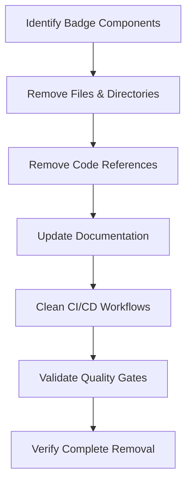

# Design Document

## Overview

This design outlines the comprehensive removal of all badge-related functionality from the mypylogger project. The badge system currently includes performance badges, documentation quality badges, and various other project status indicators. This removal will eliminate broken badge implementation logic while maintaining all core project functionality and ensuring quality gates continue to pass.

## Architecture

### Current Badge System Components

The badge system currently consists of:

1. **Badge Data Storage**: `badge-data/` directory containing JSON files
2. **Badge Generation Scripts**: Multiple Python scripts in `scripts/` directory
3. **Badge References**: Documentation and configuration references
4. **CI/CD Integration**: Workflow steps for badge generation and updates

### Removal Strategy

The removal will follow a systematic approach:



## Components and Interfaces

### File System Changes

#### Files to Remove
- `badge-data/performance-badge.json`
- `badge-data/performance-summary.json`
- `badge-data/` directory (entire)
- `scripts/generate_performance_badge.py`
- `scripts/generate_docs_badges.py`
- `scripts/update_readme_badges.py`

#### Files to Update
- `README.md` - Remove badge markdown and references
- Documentation files in `docs/` - Remove badge references
- `pyproject.toml` - Remove badge-related dependencies (if any)
- Spec files - Remove badge-related requirements and tasks
- Summary files - Remove badge references

### Code References to Remove

#### Python Import Statements
- Any imports related to badge generation modules
- Badge-related utility imports

#### Function Calls and Methods
- Badge generation function calls
- Badge update method invocations
- Performance badge creation calls

#### Configuration Variables
- Badge-related environment variables
- Badge URL configurations
- Badge threshold settings

### Documentation Updates

#### README.md Changes
- Remove badge markdown syntax (``)
- Remove badge section comments (`<!-- BADGES START -->` / `<!-- BADGES END -->`)
- Update project description to remove badge references
- Ensure documentation flow remains coherent

#### Documentation Files
- Remove badge references from all `.rst` and `.md` files in `docs/`
- Update performance documentation to remove badge generation sections
- Remove badge-related examples and code snippets

### CI/CD Workflow Updates

#### Workflow Steps to Remove
- Badge generation steps
- Badge upload actions
- Badge-related artifact handling
- Performance badge creation jobs

#### Environment Variables to Remove
- Badge-related environment variables
- Badge URL configurations
- Badge threshold settings

## Data Models

### Removal Verification Model

```python
@dataclass
class RemovalVerification:
    """Model for tracking badge removal verification."""
    
    files_removed: List[str]
    directories_removed: List[str]
    code_references_removed: List[str]
    documentation_updated: List[str]
    workflows_updated: List[str]
    quality_gates_passing: bool
    complete_removal_verified: bool
```

### Search Patterns

Badge-related content will be identified using these patterns:

```python
BADGE_PATTERNS = [
    r"badge",
    r"performance.*badge|badge.*performance",
    r"generate.*badge|badge.*generate",
    r"shields\.io",
    r"img\.shields\.io",
    r"!\[.*?\]\(.*badge.*\)",
    r"<!-- BADGES START -->.*?<!-- BADGES END -->",
]
```

## Error Handling

### Graceful Degradation Strategy

1. **File Not Found**: Continue removal process if files already don't exist
2. **Permission Errors**: Report errors but continue with other removals
3. **Git Conflicts**: Ensure clean working directory before starting
4. **Quality Gate Failures**: Stop process and report specific failures

### Validation Checks

```python
def validate_removal_complete() -> bool:
    """Validate that badge removal is complete."""
    
    # Check for remaining badge files
    badge_files = find_files_matching_patterns(BADGE_PATTERNS)
    if badge_files:
        return False
    
    # Check for badge references in code
    code_references = search_code_for_patterns(BADGE_PATTERNS)
    if code_references:
        return False
    
    # Verify quality gates pass
    if not run_quality_gates():
        return False
    
    return True
```

## Testing Strategy

### Verification Tests

1. **File System Verification**
   - Verify all badge files are removed
   - Verify badge directories are removed
   - Verify no badge-related files remain

2. **Code Reference Verification**
   - Search all Python files for badge imports
   - Search all files for badge function calls
   - Verify no broken imports remain

3. **Documentation Verification**
   - Verify README has no badge markdown
   - Verify docs have no badge references
   - Verify documentation remains coherent

4. **Quality Gate Verification**
   - Run master test script (`./scripts/run_tests.sh`)
   - Verify all tests pass
   - Verify no import errors
   - Verify no broken references

### Test Implementation

```python
def test_badge_removal_complete():
    """Test that badge removal is complete and thorough."""
    
    # Test file removal
    assert not Path("badge-data").exists()
    assert not Path("scripts/generate_performance_badge.py").exists()
    assert not Path("scripts/generate_docs_badges.py").exists()
    assert not Path("scripts/update_readme_badges.py").exists()
    
    # Test code references removed
    badge_references = search_codebase_for_badges()
    assert len(badge_references) == 0
    
    # Test documentation updated
    readme_content = Path("README.md").read_text()
    assert "![" not in readme_content or "badge" not in readme_content.lower()
    
    # Test quality gates pass
    result = subprocess.run(["./scripts/run_tests.sh"], capture_output=True)
    assert result.returncode == 0
```

## Implementation Phases

### Phase 1: File and Directory Removal
1. Remove `badge-data/` directory and all contents
2. Remove badge generation scripts from `scripts/`
3. Remove any other badge-related files

### Phase 2: Code Reference Cleanup
1. Search and remove badge-related imports
2. Remove badge-related function calls
3. Remove badge-related configuration variables
4. Fix any broken references

### Phase 3: Documentation Updates
1. Update README.md to remove badge references
2. Update documentation files to remove badge content
3. Ensure documentation flow remains coherent
4. Update project descriptions as needed

### Phase 4: CI/CD Cleanup
1. Remove badge-related workflow steps
2. Remove badge-related environment variables
3. Update workflow dependencies
4. Verify workflows still function correctly

### Phase 5: Verification and Validation
1. Run comprehensive search for remaining badge references
2. Execute quality gates to ensure project integrity
3. Verify all tests pass
4. Confirm complete removal

## Dependencies

### External Dependencies
- No new external dependencies required
- May remove badge-related dependencies from `pyproject.toml`

### Internal Dependencies
- Must maintain all existing project functionality
- Must ensure quality gates continue to pass
- Must preserve project documentation coherence

## Performance Considerations

### Removal Performance
- File operations should be fast (< 1 second)
- Search operations may take longer for large codebases
- Quality gate validation will take normal test execution time

### Post-Removal Performance
- No performance impact expected
- May slightly improve build times by removing badge generation steps
- Reduced maintenance overhead

## Security Considerations

### Safe Removal Practices
- Verify files before deletion
- Use version control to track changes
- Maintain backup through git history
- Validate changes don't break security workflows

### No Security Impact
- Badge removal should not affect project security
- No sensitive data involved in badge system
- No security-related functionality being removed