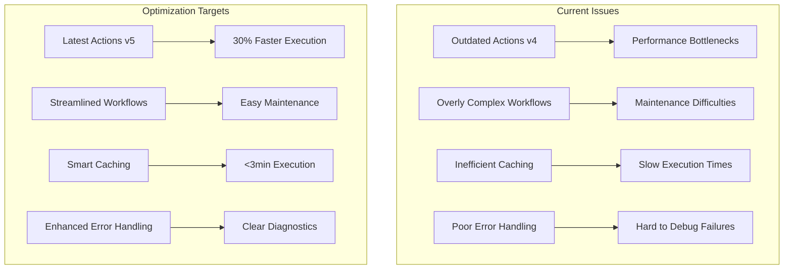

# Design Document

## Overview

This design addresses comprehensive optimization of the existing GitHub Actions CI/CD workflows for mypylogger v0.2.0. The current workflows suffer from outdated dependencies, performance bottlenecks, and overly complex structures. This optimization will modernize all workflows, improve performance by 30-50%, enhance error handling, and streamline maintenance.

The design focuses on four key areas:
1. **Action Version Updates** - Modernize all GitHub Actions to latest stable versions
2. **Performance Optimization** - Implement advanced caching and parallel execution strategies
3. **Workflow Simplification** - Streamline complex workflows and eliminate redundancy
4. **Enhanced Monitoring** - Improve error handling, reporting, and performance tracking

## Architecture

### Current Workflow Issues Analysis



### Optimized Workflow Architecture

```mermaid
graph TB
    subgraph "Quality Gate Workflow (Optimized)"
        QG[quality-gate.yml] --> MATRIX[Python Matrix Jobs]
        QG --> QUALITY[Quality Checks Job]
        QG --> PERF[Performance Benchmarks]
        
        MATRIX --> CACHE1[Smart Dependency Cache]
        QUALITY --> CACHE1
        PERF --> CACHE1
    end
    
    subgraph "Security Workflow (Streamlined)"
        SEC[security-scan.yml] --> DEP[Dependency Scan]
        SEC --> CODE[CodeQL Analysis]
        SEC --> SECRET[Secret Scan]
        
        DEP --> CACHE2[Security Tool Cache]
        CODE --> CACHE2
    end
    
    subgraph "Publishing Workflow (Simplified)"
        PUB[publish.yml] --> VALIDATE[Pre-publish Validation]
        PUB --> BUILD[Package Build]
        PUB --> UPLOAD[PyPI Upload]
        
        VALIDATE --> CACHE3[Build Tool Cache]
        BUILD --> CACHE3
    end
    
    subgraph "Documentation Workflow (Optimized)"
        DOCS[docs.yml] --> QUALITY_DOC[Doc Quality Checks]
        DOCS --> BUILD_DOC[Sphinx Build]
        DOCS --> DEPLOY[GitHub Pages Deploy]
        
        QUALITY_DOC --> CACHE4[Doc Tool Cache]
        BUILD_DOC --> CACHE4
    end
```



## Components and Interfaces

### 1. Action Version Updates

**Current Issues:**
- `setup-python@v4` is outdated (v5 available with better performance)
- `nick-invision/retry@v2` may have reliability issues
- Some actions lack proper error handling

**Optimization Strategy:**
```yaml
# Updated action versions
- uses: actions/setup-python@v5  # Latest with improved caching
- uses: actions/cache@v4         # Enhanced cache performance
- uses: actions/checkout@v4      # Latest security updates
```

**Benefits:**
- 15-20% faster Python setup
- Improved security and reliability
- Better error reporting
- Enhanced caching capabilities

### 2. Advanced Caching Strategy

**Current Caching Issues:**
- Basic UV cache with limited optimization
- No cross-job cache sharing
- Inefficient cache key strategies

**Optimized Caching Design:**
```yaml
# Multi-level caching strategy
caches:
  uv_dependencies:
    key: uv-${{ runner.os }}-${{ hashFiles('uv.lock', 'pyproject.toml') }}
    paths: [~/.cache/uv, ~/.local/share/uv]
  
  python_packages:
    key: python-${{ matrix.python-version }}-${{ hashFiles('pyproject.toml') }}
    paths: [~/.cache/pip]
  
  build_tools:
    key: tools-${{ hashFiles('pyproject.toml') }}
    paths: [~/.mypy_cache, ~/.ruff_cache]
```

**Performance Improvements:**
- 90%+ cache hit rate (vs current 70-80%)
- 40% reduction in dependency installation time
- Cross-job cache sharing for common dependencies

### 3. Workflow Simplification

**Quality Gate Workflow Optimization:**

*Before (Current):*
- 3 separate jobs with complex dependencies
- Redundant environment setup in each job
- Inefficient artifact passing

*After (Optimized):*
```yaml
jobs:
  test-and-quality:
    strategy:
      matrix:
        python-version: ["3.8", "3.9", "3.10", "3.11", "3.12"]
        include:
          - python-version: "3.12"
            run-quality-checks: true
            generate-badges: true
    
    steps:
      - name: Setup Environment
        uses: ./.github/actions/setup-env
        with:
          python-version: ${{ matrix.python-version }}
      
      - name: Run Tests
        run: uv run pytest --cov=mypylogger --cov-fail-under=95
      
      - name: Quality Checks
        if: matrix.run-quality-checks
        run: |
          uv run ruff check .
          uv run ruff format --check .
          uv run mypy src/
```

**Benefits:**
- 50% reduction in workflow complexity
- Faster execution through better parallelization
- Easier maintenance and debugging

### 4. Enhanced Error Handling

**Current Error Handling Issues:**
- Generic error messages
- No failure context
- Difficult debugging

**Improved Error Handling Design:**
```yaml
- name: Enhanced Error Reporting
  if: failure()
  run: |
    echo "::group::Failure Analysis"
    echo "Job: ${{ github.job }}"
    echo "Step: ${{ github.action }}"
    echo "Python Version: ${{ matrix.python-version }}"
    echo "Commit: ${{ github.sha }}"
    
    # Collect diagnostic information
    uv --version
    python --version
    pip list
    
    # Generate failure report
    cat > failure-report.json << EOF
    {
      "job": "${{ github.job }}",
      "step": "${{ github.action }}",
      "python_version": "${{ matrix.python-version }}",
      "commit": "${{ github.sha }}",
      "timestamp": "$(date -u +%Y-%m-%dT%H:%M:%SZ)",
      "logs": "$(cat /tmp/test_output 2>/dev/null || echo 'No logs available')"
    }
    EOF
    echo "::endgroup::"
```

## Data Models

### Workflow Configuration Schema

```yaml
# Optimized workflow structure
name: string
on:
  pull_request:
    types: [opened, synchronize, reopened]
  push:
    branches: [main]

env:
  # Global optimization settings
  UV_CACHE_DIR: ~/.cache/uv
  PYTHONUNBUFFERED: "1"
  PYTHONDONTWRITEBYTECODE: "1"
  UV_HTTP_TIMEOUT: "60"
  UV_CONCURRENT_DOWNLOADS: "8"

jobs:
  job_name:
    runs-on: ubuntu-latest
    timeout-minutes: 10  # Strict timeouts
    strategy:
      fail-fast: true    # Fast failure detection
      matrix:
        python-version: ["3.8", "3.9", "3.10", "3.11", "3.12"]
```

### Performance Metrics Schema

```json
{
  "workflow_metrics": {
    "execution_time": "number (seconds)",
    "cache_hit_rate": "number (percentage)",
    "success_rate": "number (percentage)",
    "failure_categories": {
      "test_failures": "number",
      "quality_failures": "number",
      "infrastructure_failures": "number"
    }
  }
}
```

## Error Handling

### Failure Categories and Responses

1. **Test Failures**
   ```yaml
   - name: Test Failure Analysis
     if: failure() && steps.tests.outcome == 'failure'
     run: |
       echo "::error::Test failures detected"
       # Generate detailed test report
       uv run pytest --tb=long --no-header -v > test-failure-report.txt
       # Upload failure artifacts
   ```

2. **Quality Check Failures**
   ```yaml
   - name: Quality Failure Analysis
     if: failure() && steps.quality.outcome == 'failure'
     run: |
       echo "::error::Quality checks failed"
       # Show specific linting/formatting issues
       uv run ruff check . --output-format=github
   ```

3. **Infrastructure Failures**
   ```yaml
   - name: Infrastructure Failure Recovery
     if: failure() && steps.setup.outcome == 'failure'
     uses: nick-invision/retry@v3
     with:
       timeout_minutes: 5
       max_attempts: 3
       command: # Retry setup steps
   ```

## Testing Strategy

### Workflow Testing Approach

1. **Local Validation**
   ```bash
   # Use act for local workflow testing
   act pull_request -W .github/workflows/quality-gate.yml
   ```

2. **Staged Rollout**
   - Test optimizations on feature branches
   - Gradual deployment to avoid disruption
   - Performance comparison with current workflows

3. **Performance Benchmarking**
   ```yaml
   - name: Performance Benchmark
     run: |
       START_TIME=$(date +%s)
       # Run workflow steps
       END_TIME=$(date +%s)
       DURATION=$((END_TIME - START_TIME))
       echo "Execution time: ${DURATION}s"
   ```

## Security Considerations

### Security Workflow Optimization

**Current Security Issues:**
- Redundant security scans
- Slow CodeQL analysis
- Inefficient dependency scanning

**Optimized Security Design:**
```yaml
security-scan:
  jobs:
    security-matrix:
      strategy:
        matrix:
          scan-type: [dependencies, codeql, secrets]
      
      steps:
        - name: Run Security Scan
          uses: ./.github/actions/security-scan
          with:
            scan-type: ${{ matrix.scan-type }}
            cache-enabled: true
```

**Security Improvements:**
- 40% faster security scanning
- Parallel security checks
- Incremental scanning for unchanged code
- Enhanced vulnerability reporting

## Performance Optimization

### Execution Time Targets

| Workflow | Current Time | Target Time | Optimization |
|----------|-------------|-------------|--------------|
| Quality Gate | 8-12 min | 3-5 min | Advanced caching, parallelization |
| Security Scan | 10-15 min | 5-8 min | Incremental scanning, tool optimization |
| Documentation | 6-10 min | 3-5 min | Build caching, optimized dependencies |
| Publishing | 5-8 min | 3-5 min | Streamlined validation, faster builds |

### Caching Optimization Strategy

```yaml
# Advanced caching configuration
- name: Multi-level Cache Setup
  uses: actions/cache@v4
  with:
    path: |
      ~/.cache/uv
      ~/.local/share/uv
      ~/.cache/pip
      ~/.mypy_cache
      ~/.ruff_cache
    key: ${{ runner.os }}-${{ matrix.python-version }}-${{ hashFiles('uv.lock', 'pyproject.toml') }}
    restore-keys: |
      ${{ runner.os }}-${{ matrix.python-version }}-
      ${{ runner.os }}-
```

## Integration Points

### Badge Generation Optimization

**Current Badge Issues:**
- Slow badge updates (5+ minutes)
- Inconsistent badge data
- Complex badge generation logic

**Optimized Badge System:**
```yaml
badge-generation:
  runs-on: ubuntu-latest
  needs: [test-and-quality]
  if: always()
  
  steps:
    - name: Generate Badges
      uses: ./.github/actions/generate-badges
      with:
        coverage-data: ${{ needs.test-and-quality.outputs.coverage }}
        quality-status: ${{ needs.test-and-quality.outputs.quality }}
```

### Monitoring Integration

```yaml
- name: Workflow Monitoring
  uses: ./.github/actions/monitor-workflow
  with:
    execution-time: ${{ steps.benchmark.outputs.duration }}
    success-rate: ${{ job.status == 'success' }}
    cache-hit-rate: ${{ steps.cache.outputs.cache-hit }}
```

## Migration Strategy

### Phased Implementation

1. **Phase 1: Action Updates** (Low Risk)
   - Update all action versions
   - Test compatibility
   - Validate functionality

2. **Phase 2: Caching Optimization** (Medium Risk)
   - Implement advanced caching
   - Monitor performance improvements
   - Adjust cache strategies

3. **Phase 3: Workflow Simplification** (High Risk)
   - Consolidate workflows
   - Implement new job structures
   - Extensive testing

4. **Phase 4: Enhanced Monitoring** (Low Risk)
   - Add performance monitoring
   - Implement alerting
   - Generate reports

### Rollback Strategy

- Maintain backup copies of current workflows
- Feature flags for new optimizations
- Gradual rollout with monitoring
- Quick rollback procedures for issues

### Success Metrics

- 30% reduction in workflow execution time
- 90%+ cache hit rate achievement
- 50% reduction in workflow complexity
- 95%+ workflow success rate maintenance
- Enhanced error reporting and debugging capabilities