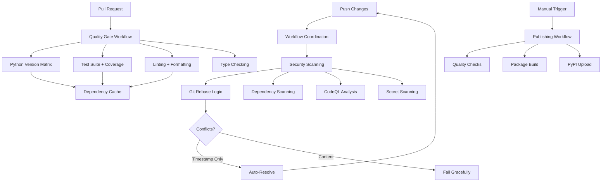

# Design Document

## Overview

Phase 3 implements a comprehensive CI/CD pipeline using GitHub Actions to enforce quality gates, automate testing across multiple Python versions, and provide secure package publishing capabilities. The design focuses on fast feedback, security-first approach, and consistency with local development environments.

**CRITICAL UPDATE**: This phase now includes race condition prevention through proper Git rebase logic and workflow coordination, as addressed by the Rebase Fix Phase.

The system consists of three primary workflows:
1. **Quality Gate Workflow** - Runs on every pull request to enforce code quality
2. **Security Scanning Workflow** - Continuous security monitoring with zero-tolerance policy and race condition prevention
3. **Publishing Workflow** - Manual trigger for secure PyPI package distribution

### Race Condition Prevention Integration

All workflows now implement:
- **Concurrency controls** to prevent simultaneous execution
- **Git rebase logic** with `git pull --rebase origin main` before pushes
- **Automated conflict resolution** for timestamp-only conflicts
- **Linear commit history** maintenance without merge commits

## Architecture

### Workflow Architecture



### Repository Structure

```
.github/
├── workflows/
│   ├── quality-gate.yml      # PR quality checks
│   ├── security-scan.yml     # Security monitoring
│   └── publish.yml           # PyPI publishing
├── dependabot.yml            # Dependency updates
└── CODEOWNERS               # Code review assignments
```

## Components and Interfaces

### 1. Quality Gate Workflow (`quality-gate.yml`)

**Purpose**: Enforce code quality standards on every pull request

**Triggers**:
- Pull request creation/updates
- Push to pull request branches

**Jobs**:
- **test-matrix**: Run tests across Python 3.8-3.12
- **quality-checks**: Linting, formatting, type checking
- **coverage-report**: Generate and validate test coverage

**Key Features**:
- Parallel execution across Python versions
- Dependency caching for performance
- Fail-fast strategy for obvious issues
- Detailed error reporting

### 2. Security Scanning Workflow (`security-scan.yml`)

**Purpose**: Continuous security monitoring with zero-tolerance policy

**Triggers**:
- Push to main branch
- Scheduled daily scans
- Manual trigger

**Security Checks**:
- **Dependabot**: Dependency vulnerability scanning
- **CodeQL**: Static code analysis for security issues
- **Secret Scanning**: Detect exposed secrets/tokens
- **Supply Chain**: Verify package integrity

**Zero-Tolerance Policy**:
- Any security issue fails the workflow
- Blocks pull request merging
- Requires resolution before code integration

### 3. Publishing Workflow (`publish.yml`)

**Purpose**: Secure, manual package publishing to PyPI

**Triggers**:
- Manual workflow dispatch only
- Requires explicit approval

**Publishing Steps**:
1. Run complete quality gate checks
2. Verify security scans pass
3. Build package using standard tools
4. Authenticate with PyPI using trusted publishing
5. Upload to PyPI with verification

### 4. Trusted Publishing Configuration

**Purpose**: Secure PyPI publishing without credential management

**Configuration Parameters**:
```yaml
permissions:
  id-token: write
  contents: read
environment: pypi-publishing
```

**Key Features**:
- No stored credentials required
- Direct OIDC authentication with PyPI
- Repository-specific publishing permissions
- Automatic authentication via GitHub identity

## Data Models

### Workflow Configuration Schema

```yaml
# Common workflow structure
name: string
on: 
  pull_request: object
  push: object
  workflow_dispatch: object
  schedule: array

jobs:
  job_name:
    runs-on: string
    strategy:
      matrix: object
    steps:
      - name: string
        uses: string
        with: object
        env: object
```

### Environment Variables

```yaml
# Required for all workflows
UV_CACHE_DIR: ~/.cache/uv
PYTHON_VERSION_MATRIX: "3.8,3.9,3.10,3.11,3.12"
COVERAGE_THRESHOLD: "95"

# Security scanning
CODEQL_LANGUAGES: "python"
DEPENDABOT_SCHEDULE: "daily"

# Trusted Publishing Configuration
PYPI_ENVIRONMENT: "pypi-publishing"
OIDC_PERMISSIONS: "id-token:write,contents:read"
```

### Caching Strategy

```yaml
# UV dependency cache
- uses: actions/cache@v4
  with:
    path: ~/.cache/uv
    key: uv-${{ runner.os }}-${{ hashFiles('uv.lock') }}
    restore-keys: uv-${{ runner.os }}-

# Python setup cache
- uses: actions/setup-python@v4
  with:
    python-version: ${{ matrix.python-version }}
    cache: 'pip'
```

**Important**: UV cache directories (`.uv/`, `.uv-cache/`, `uv.cache/`) are excluded from version control via `.gitignore` to prevent repository bloat and ensure clean CI environments.

## Error Handling

### Workflow Failure Scenarios

1. **Test Failures**
   - Display failed test details
   - Show coverage gaps if below 95%
   - Provide actionable error messages

2. **Quality Check Failures**
   - Show specific linting errors with file locations
   - Display formatting differences
   - Report type checking issues with context

3. **Security Issues**
   - Block workflow immediately
   - Generate detailed security reports
   - Require manual resolution before proceeding

4. **Publishing Failures**
   - Validate all prerequisites before upload
   - Provide clear authentication error messages
   - Rollback on partial failures

### Error Recovery

```yaml
# Retry strategy for transient failures
- uses: nick-invision/retry@v2
  with:
    timeout_minutes: 10
    max_attempts: 3
    command: uv run pytest --cov=mypylogger --cov-fail-under=95
```

## Testing Strategy

### Workflow Testing Approach

1. **Local Validation**
   - Use `act` tool to test workflows locally
   - Validate workflow syntax before committing
   - Test matrix configurations

2. **Staging Environment**
   - Test workflows on feature branches
   - Validate caching behavior
   - Verify security scanning integration

3. **Production Validation**
   - Monitor workflow performance metrics
   - Track failure rates and resolution times
   - Validate publishing process end-to-end

### Quality Metrics

- **Workflow Success Rate**: >95% for quality gates
- **Execution Time**: <5 minutes for typical changes
- **Cache Hit Rate**: >80% for dependency caching
- **Security Issue Resolution**: <24 hours

## Security Considerations

### Trusted Publishing

```yaml
# PyPI publishing with trusted publishing
permissions:
  id-token: write
  contents: read

- name: Publish to PyPI
  uses: pypa/gh-action-pypi-publish@release/v1
  # No credentials needed - uses trusted publishing
```

### Secret Management

- **No hardcoded secrets** in workflow files
- Use GitHub secrets for sensitive data
- Rotate tokens regularly
- Audit secret access logs

### Branch Protection Rules

```yaml
# Required status checks
required_status_checks:
  strict: true
  contexts:
    - "test-matrix (3.8)"
    - "test-matrix (3.9)" 
    - "test-matrix (3.10)"
    - "test-matrix (3.11)"
    - "test-matrix (3.12)"
    - "quality-checks"
    - "security-scan"

# Additional protections
enforce_admins: true
required_pull_request_reviews:
  required_approving_review_count: 1
  dismiss_stale_reviews: true
```

## Performance Optimization

### Caching Strategy

1. **UV Dependencies**: Cache based on `uv.lock` hash
2. **Python Installations**: Cache Python versions
3. **Test Results**: Cache test databases and fixtures
4. **Build Artifacts**: Cache intermediate build files

**Cache Exclusion**: UV cache directories are excluded from version control to ensure:
- Clean repository without build artifacts
- Consistent CI environment setup
- Reduced repository size and clone times
- Proper cache invalidation in CI workflows

### Parallel Execution

- Run Python version matrix in parallel
- Execute quality checks concurrently
- Separate security scans from quality gates

### Resource Management

- Use appropriate runner sizes
- Optimize for cost vs. performance
- Monitor resource usage patterns

## Integration Points

### GitHub Features

- **Branch Protection**: Enforce workflow requirements
- **Status Checks**: Display workflow results in PRs
- **Security Advisories**: Integrate with vulnerability database
- **Dependabot**: Automated dependency updates

### External Services

- **PyPI**: Package publishing destination
- **CodeQL**: Security analysis engine
- **UV Package Manager**: Dependency management
- **Coverage.py**: Test coverage reporting

## Monitoring and Observability

### Workflow Metrics

- Execution time trends
- Failure rate analysis
- Cache effectiveness
- Security issue frequency

### Alerting

- Workflow failures notify maintainers
- Security issues trigger immediate alerts
- Publishing failures require manual intervention
- Performance degradation warnings

## Migration Strategy

### Implementation Phases

1. **Phase 3.1**: Basic quality gate workflow
2. **Phase 3.2**: Security scanning integration
3. **Phase 3.3**: Publishing workflow setup
4. **Phase 3.4**: Branch protection enforcement

### Rollback Plan

- Keep existing manual processes during transition
- Gradual enforcement of new requirements
- Ability to disable workflows if issues arise
- Documentation for emergency procedures