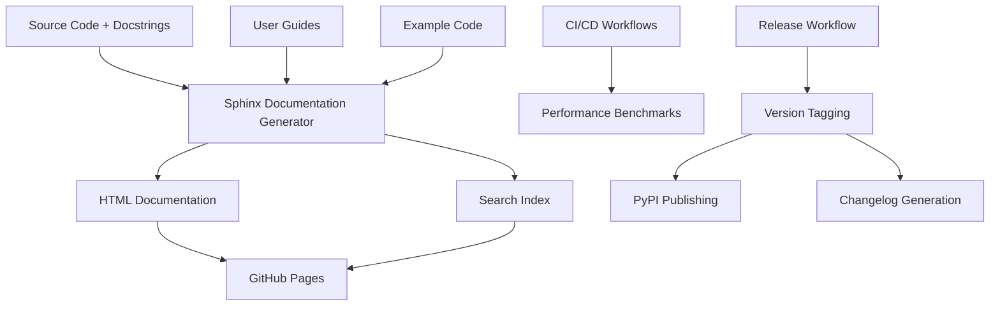

# Design Document

## Overview

Phase 4 implements comprehensive documentation and establishes a complete publishing workflow for mypylogger v0.2.4. The design focuses on creating professional-grade documentation that demonstrates the library's value proposition while integrating performance monitoring into existing CI/CD workflows.

The system consists of four primary components:
1. **Documentation Generation System** - Automated documentation using Sphinx and GitHub Pages
2. **Performance Monitoring Integration** - Enhanced CI/CD workflows with performance benchmarks
3. **Release Automation** - Streamlined version management and PyPI publishing
4. **User Experience Optimization** - Comprehensive guides and examples for all use cases

## Architecture

### Documentation Architecture



### Project Structure

```
docs/
├── source/
│   ├── conf.py                 # Sphinx configuration
│   ├── index.rst              # Documentation home page
│   ├── installation.rst       # Installation guide
│   ├── quickstart.rst         # Quick start tutorial
│   ├── api/                   # API reference
│   │   ├── index.rst
│   │   ├── core.rst
│   │   ├── config.rst
│   │   └── exceptions.rst
│   ├── guides/                # User guides
│   │   ├── basic-usage.rst
│   │   ├── configuration.rst
│   │   ├── frameworks.rst
│   │   └── migration.rst
│   ├── examples/              # Code examples
│   │   ├── basic/
│   │   ├── web-apps/
│   │   ├── cli-apps/
│   │   └── serverless/
│   └── performance/           # Performance documentation
│       ├── benchmarks.rst
│       └── optimization.rst
├── build/                     # Generated documentation
└── requirements.txt           # Documentation dependencies

.github/workflows/
├── quality-gate.yml          # Enhanced with performance benchmarks
├── update-badges.yml         # Enhanced with performance badges
├── docs.yml                  # Documentation building and deployment
└── release.yml               # Automated release workflow
```

## Components and Interfaces

### 1. Sphinx Documentation System

**Purpose**: Generate professional documentation from source code and guides

**Key Features**:
- **Autodoc**: Automatic API documentation from docstrings
- **Napoleon**: Google-style docstring parsing
- **Search**: Full-text search functionality
- **Themes**: Professional, mobile-responsive theme
- **Extensions**: Code highlighting, cross-references, examples

**Configuration** (`docs/source/conf.py`):
```python
extensions = [
    'sphinx.ext.autodoc',
    'sphinx.ext.napoleon',
    'sphinx.ext.viewcode',
    'sphinx.ext.intersphinx',
    'sphinx_rtd_theme',
]

html_theme = 'sphinx_rtd_theme'
autodoc_typehints = 'description'
napoleon_google_docstring = True
```

### 2. Performance Monitoring Integration

**Purpose**: Integrate performance benchmarks into existing CI/CD workflows

**Enhanced Workflows**:

#### Updated `quality-gate.yml`:
```yaml
jobs:
  test-matrix:
    # ... existing test configuration
    
  performance-benchmarks:
    runs-on: ubuntu-latest
    steps:
      - uses: actions/checkout@v4
      - name: Set up Python
        uses: actions/setup-python@v4
        with:
          python-version: '3.11'
      
      - name: Install dependencies
        run: |
          uv sync
          uv add --dev pytest-benchmark
      
      - name: Run performance benchmarks
        run: |
          uv run pytest tests/performance/ --benchmark-json=benchmark.json
      
      - name: Validate performance thresholds
        run: |
          python scripts/validate_performance.py benchmark.json
      
      - name: Upload benchmark results
        uses: actions/upload-artifact@v4
        with:
          name: benchmark-results
          path: benchmark.json
```

#### ~~Updated `update-badges.yml`~~ (Badge system removed):
```yaml
# Badge generation workflow removed as part of badge system cleanup
# Performance benchmarks are still available via artifacts for manual review
```

### 3. Documentation Deployment Workflow

**Purpose**: Automated documentation building and GitHub Pages deployment

**Workflow** (`docs.yml`):
```yaml
name: Documentation

on:
  push:
    branches: [main]
  pull_request:
    branches: [main]

jobs:
  build-docs:
    runs-on: ubuntu-latest
    steps:
      - uses: actions/checkout@v4
      
      - name: Set up Python
        uses: actions/setup-python@v4
        with:
          python-version: '3.11'
      
      - name: Install documentation dependencies
        run: |
          uv sync
          uv add --dev sphinx sphinx-rtd-theme
      
      - name: Build documentation
        run: |
          cd docs
          uv run sphinx-build -b html source build
      
      - name: Deploy to GitHub Pages
        if: github.ref == 'refs/heads/main'
        uses: peaceiris/actions-gh-pages@v3
        with:
          github_token: ${{ secrets.GITHUB_TOKEN }}
          publish_dir: ./docs/build
```

### 4. Release Automation Workflow

**Purpose**: Streamlined version management and PyPI publishing

**Workflow** (`release.yml`):
```yaml
name: Release

on:
  workflow_dispatch:
    inputs:
      version_type:
        description: 'Version bump type'
        required: true
        default: 'patch'
        type: choice
        options:
          - patch
          - minor
          - major

jobs:
  release:
    runs-on: ubuntu-latest
    steps:
      - uses: actions/checkout@v4
        with:
          fetch-depth: 0
      
      - name: Set up Python
        uses: actions/setup-python@v4
        with:
          python-version: '3.11'
      
      - name: Install release tools
        run: |
          uv add --dev bump2version
      
      - name: Bump version
        run: |
          uv run bump2version ${{ github.event.inputs.version_type }}
      
      - name: Generate changelog
        run: |
          python scripts/generate_changelog.py
      
      - name: Run full quality gate
        run: |
          ./scripts/run_tests.sh
      
      - name: Build package
        run: |
          uv build
      
      - name: Create GitHub release
        uses: softprops/action-gh-release@v1
        with:
          tag_name: v${{ env.NEW_VERSION }}
          name: Release v${{ env.NEW_VERSION }}
          body_path: CHANGELOG_LATEST.md
      
      - name: Publish to PyPI
        uses: pypa/gh-action-pypi-publish@release/v1
```

## Data Models

### Documentation Structure

```python
# Documentation content organization
DocumentationSite = {
    "home": {
        "overview": "Library introduction and key features",
        "installation": "Quick installation instructions",
        "quickstart": "5-minute getting started guide"
    },
    "guides": {
        "basic_usage": "Core logging patterns and examples",
        "configuration": "Environment variables and settings",
        "frameworks": "Integration with Flask, Django, FastAPI",
        "migration": "Moving from other logging libraries"
    },
    "api": {
        "core": "get_logger() and main functions",
        "config": "Configuration classes and validation",
        "exceptions": "Custom exception hierarchy",
        "formatters": "JSON formatting and customization"
    },
    "examples": {
        "web_apps": "Complete web application examples",
        "cli_apps": "Command-line application patterns",
        "serverless": "AWS Lambda and cloud functions",
        "performance": "High-throughput logging scenarios"
    }
}
```

### Performance Benchmark Schema

```python
# Performance benchmark data structure
BenchmarkResult = {
    "logger_initialization": {
        "mean_time_ms": float,
        "std_dev_ms": float,
        "threshold_ms": 10.0,
        "status": "pass" | "fail"
    },
    "single_log_entry": {
        "mean_time_ms": float,
        "std_dev_ms": float,
        "threshold_ms": 1.0,
        "status": "pass" | "fail"
    },
    "memory_usage": {
        "baseline_mb": float,
        "per_logger_mb": float,
        "per_entry_kb": float
    },
    "throughput": {
        "entries_per_second": int,
        "sustained_rate": int
    }
}
```

### Package Metadata Configuration

```toml
# pyproject.toml enhancements
[project]
name = "mypylogger"
description = "Zero-dependency JSON logging library with sensible defaults"
readme = "README.md"
license = {text = "MIT"}
authors = [{name = "Author Name", email = "author@example.com"}]
keywords = ["logging", "json", "structured", "zero-dependency"]
classifiers = [
    "Development Status :: 4 - Beta",
    "Intended Audience :: Developers",
    "License :: OSI Approved :: MIT License",
    "Programming Language :: Python :: 3",
    "Programming Language :: Python :: 3.8",
    "Programming Language :: Python :: 3.9",
    "Programming Language :: Python :: 3.10",
    "Programming Language :: Python :: 3.11",
    "Programming Language :: Python :: 3.12",
    "Topic :: Software Development :: Libraries :: Python Modules",
    "Topic :: System :: Logging",
]

[project.urls]
Homepage = "https://github.com/username/mypylogger"
Documentation = "https://username.github.io/mypylogger"
Repository = "https://github.com/username/mypylogger"
Issues = "https://github.com/username/mypylogger/issues"
Changelog = "https://github.com/username/mypylogger/blob/main/CHANGELOG.md"
```

## Error Handling

### Documentation Build Failures

1. **Missing Docstrings**
   - Fail build if any public function lacks documentation
   - Provide specific file and function names
   - Require 100% docstring coverage

2. **Broken Links**
   - Validate all internal and external links
   - Fail build on any broken references
   - Provide link checking reports

3. **Sphinx Build Errors**
   - Clear error messages for syntax issues
   - Line-by-line error reporting
   - Automatic retry for transient failures

### Performance Benchmark Failures

1. **Threshold Violations**
   - Fail CI/CD if performance degrades beyond thresholds
   - Provide detailed performance comparison reports
   - Suggest optimization strategies

2. **Benchmark Execution Errors**
   - Graceful handling of benchmark failures
   - Fallback to previous performance data
   - Clear error reporting for debugging

## Testing Strategy

### Documentation Testing

1. **Docstring Coverage**
   ```bash
   # Validate 100% docstring coverage
   uv run interrogate src/ --fail-under=100
   ```

2. **Link Validation**
   ```bash
   # Check all documentation links
   uv run sphinx-build -b linkcheck docs/source docs/build
   ```

3. **Example Code Testing**
   ```bash
   # Test all code examples in documentation
   uv run pytest docs/examples/ --doctest-modules
   ```

### Performance Testing

1. **Benchmark Suite**
   ```python
   # tests/performance/test_benchmarks.py
   def test_logger_initialization_performance(benchmark):
       result = benchmark(get_logger, "test_app")
       assert benchmark.stats.mean < 0.01  # 10ms threshold
   
   def test_log_entry_performance(benchmark):
       logger = get_logger("perf_test")
       result = benchmark(logger.info, "Test message")
       assert benchmark.stats.mean < 0.001  # 1ms threshold
   ```

2. **Memory Usage Testing**
   ```python
   def test_memory_usage():
       import psutil
       process = psutil.Process()
       
       baseline = process.memory_info().rss
       logger = get_logger("memory_test")
       
       # Log 1000 entries
       for i in range(1000):
           logger.info(f"Message {i}")
       
       final = process.memory_info().rss
       memory_per_entry = (final - baseline) / 1000
       
       assert memory_per_entry < 1024  # Less than 1KB per entry
   ```

## Security Considerations

### Documentation Security

- **No Sensitive Information**: Ensure examples don't contain real credentials
- **Link Validation**: Prevent malicious link injection
- **Content Sanitization**: Escape user-provided content in examples

### Release Security

- **Signed Releases**: Use GPG signing for release tags
- **Checksum Verification**: Provide checksums for package verification
- **Dependency Scanning**: Scan documentation dependencies for vulnerabilities

## Performance Optimization

### Documentation Build Performance

1. **Incremental Builds**: Only rebuild changed documentation
2. **Caching**: Cache Sphinx build artifacts
3. **Parallel Processing**: Use parallel Sphinx builds when possible

### CI/CD Performance Integration

1. **Benchmark Caching**: Cache benchmark baselines between runs
2. **Selective Testing**: Run performance tests only on relevant changes
3. **Parallel Execution**: Run performance tests alongside other quality checks

## Integration Points

### GitHub Integration

- **Pages Deployment**: Automatic documentation deployment
- **Release Management**: Automated release creation and tagging
- **Issue Templates**: Documentation improvement request templates

### PyPI Integration

- **Metadata Synchronization**: Keep PyPI metadata current with project state
- **Version Management**: Automated version bumping and publishing
- **Download Analytics**: Track package adoption metrics

### ~~Badge Integration~~ (Badge system removed)

- ~~**Performance Badges**: Real-time performance metrics display~~
- ~~**Documentation Badges**: Documentation coverage and build status~~
- ~~**Quality Badges**: Overall project health indicators~~

## Migration Strategy

### Phase 4 Implementation Approach

1. **Phase 4.1**: Basic documentation structure and Sphinx setup
2. **Phase 4.2**: Performance monitoring integration with existing CI/CD
3. **Phase 4.3**: Complete user guides and API documentation
4. **Phase 4.4**: Release automation and PyPI publishing workflow

### Existing Workflow Enhancement

1. **Backward Compatibility**: Ensure existing workflows continue to function
2. **Gradual Integration**: Add performance monitoring without disrupting current processes
3. **Validation**: Test enhanced workflows thoroughly before deployment

This design ensures comprehensive documentation while seamlessly integrating performance monitoring into the existing CI/CD infrastructure, providing users with professional-grade documentation and maintainers with automated release processes.