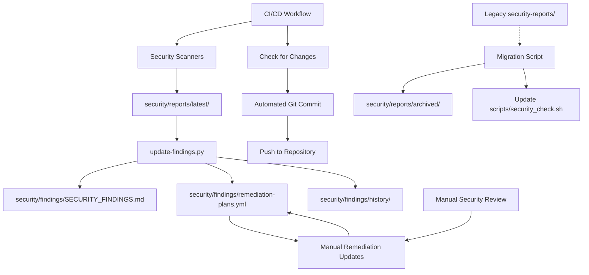

# Design Document

## Overview

The Security Module provides comprehensive security governance through a self-contained `security/` directory structure. This design establishes automated vulnerability tracking, structured remediation planning, and real-time security documentation. The module operates as a cohesive system where findings, remediation plans, and historical data are automatically synchronized and maintained.

## Architecture

### Final Directory Structure

```
security/
├── findings/
│   ├── SECURITY_FINDINGS.md          # Live findings document (auto-generated)
│   ├── remediation-plans.yml         # Structured remediation datastore
│   └── history/                      # Historical tracking and audit trails
│       ├── findings-changelog.md     # Chronological finding changes
│       └── remediation-timeline.yml  # Remediation progress tracking
├── reports/
│   ├── latest/                       # Current scan outputs
│   │   ├── pip-audit.json
│   │   ├── bandit.json
│   │   ├── secrets-scan.json
│   │   └── dependency-tree.txt
│   └── archived/                     # Historical scan data
│       └── YYYY-MM-DD/              # Date-organized archives
├── scripts/
│   ├── update-findings.py            # Core automation engine
│   ├── sync-remediation.py           # Remediation synchronization
│   └── generate-reports.py           # Document generation
├── config/
│   ├── scanner-settings.yml          # Scanner configurations
│   ├── findings-template.md          # Document templates
│   └── remediation-defaults.yml      # Default remediation values
└── README.md                         # Module documentation and usage
```

### Migration Strategy

The system includes migration capabilities to transition from existing security infrastructure:

#### Legacy Integration
- **Existing Reports**: Migrate `security-reports/` content to `security/reports/archived/`
- **Script Updates**: Update `scripts/security_check.sh` to use new directory paths
- **Workflow Integration**: Modify CI/CD workflows to output to `security/reports/latest/`
- **Data Preservation**: Maintain historical scan data and findings during transition

#### Migration Process
1. **Data Migration**: Move existing security reports to appropriate archived locations
2. **Path Updates**: Update all scripts and workflows to use new `security/` structure
3. **Validation**: Verify migrated data accessibility and script functionality
4. **Cleanup**: Remove legacy directories after successful migration

### System Behavior



## Components and Interfaces

### Live Findings Document

**Location**: `security/findings/SECURITY_FINDINGS.md`

**Structure**:
```markdown
# Security Findings Summary

**Last Updated**: 2025-10-24 14:30:00 UTC  
**Total Active Findings**: 3  
**Days Since Last Scan**: 0  

## Current Findings

### High Severity

#### CVE-2025-8869 - Arbitrary File Overwrite in pip
- **Package**: pip 25.2
- **Source**: pip-audit
- **Discovered**: 2025-10-24 (1 days active)
- **Description**: Fallback extraction path allows malicious sdist to escape target directory and overwrite arbitrary files during pip install
- **Impact**: Arbitrary file overwrite outside build directory, potential code execution
- **Reference**: https://github.com/advisories/GHSA-4xh5-x5gv-qwph
- **Fix Available**: Yes (pip 25.3 planned)
- **Remediation**: Waiting for upstream release
- **Planned Fix Date**: 2025-11-15
- **Assigned To**: security-team
- **Workaround**: None - requires malicious sdist installation

### Medium Severity

#### CVE-2022-42969 - ReDoS in py Library
- **Package**: py 1.11.0  
- **Source**: pip-audit
- **Discovered**: 2025-10-23 (2 days active)
- **Description**: Regular expression Denial of Service attack via crafted Subversion repository info data
- **Impact**: Remote DoS attack, service disruption
- **Reference**: https://nvd.nist.gov/vuln/detail/CVE-2022-42969
- **Fix Available**: No (library deprecated)
- **Remediation**: Replace with modern alternative
- **Planned Fix Date**: 2025-10-30
- **Assigned To**: dev-team
- **Workaround**: Limit Subversion repository access

## Remediation Summary

**Planned Actions**: 2  
**Awaiting Upstream**: 1  
**In Progress**: 1  
**Completed This Month**: 0  
```

### Remediation Registry

**Location**: `security/findings/remediation-plans.yml`

**Structure**:
```yaml
findings:
  CVE-2025-8869:
    finding_id: "CVE-2025-8869"
    package: "pip"
    version: "25.2"
    severity: "high"
    remediation:
      status: "awaiting_upstream"
      planned_action: "Upgrade to pip 25.3 when released"
      target_date: "2025-11-15"
      assigned_to: "security-team"
      notes: "Official fix planned for pip 25.3 release"
      workaround: "None - vulnerability requires malicious sdist"
    
  CVE-2022-42969:
    finding_id: "CVE-2022-42969"
    package: "py"
    version: "1.11.0"
    severity: "medium"
    remediation:
      status: "in_progress"
      planned_action: "Replace py library with modern alternative"
      target_date: "2025-10-30"
      assigned_to: "dev-team"
      notes: "Library is deprecated, evaluating pytest-xdist migration"
      workaround: "Limit Subversion repository access"

defaults:
  new_finding:
    status: "new"
    planned_action: "Under evaluation"
    target_date: null
    assigned_to: "security-team"
    notes: "Newly discovered - assessment in progress"
    workaround: "None identified"
```

### Reports Storage

**Location**: `security/reports/`

**Organization**:
- `latest/` - Current scan outputs, overwritten on each run
- `archived/YYYY-MM-DD/` - Historical scan data for trend analysis
- Standardized filenames: `pip-audit.json`, `bandit.json`, `secrets-scan.json`

## Data Models

### Finding Record

```python
@dataclass
class SecurityFinding:
    finding_id: str          # CVE-2025-8869, GHSA-xxx, etc.
    package: str             # Affected package name
    version: str             # Vulnerable version
    severity: str            # high, medium, low, info
    source_scanner: str      # pip-audit, bandit, secrets
    discovered_date: date    # When first detected
    description: str         # Vulnerability description
    impact: str              # Business/technical impact
    fix_available: bool      # Whether fix exists
    fix_version: Optional[str] # Version that fixes issue
    cvss_score: Optional[float] # CVSS severity score
    reference_url: Optional[str] # Link to detailed vulnerability information
```

### Remediation Plan

```python
@dataclass
class RemediationPlan:
    finding_id: str          # Links to SecurityFinding
    status: str              # new, in_progress, awaiting_upstream, completed
    planned_action: str      # Description of planned fix
    target_date: Optional[date] # Expected completion
    assigned_to: str         # Responsible team/person
    notes: str               # Additional context
    workaround: str          # Temporary mitigation if any
    priority: str            # critical, high, medium, low
    business_impact: str     # Impact on business operations
```

## Automated Repository Updates

### Git Integration

The security findings system automatically commits changes to maintain repository state synchronization:

#### Change Detection
- **File monitoring**: Check for modifications in `security/findings/` and `security/reports/`
- **Content comparison**: Use git diff to detect actual changes vs. timestamp updates
- **Selective commits**: Only commit when substantive changes are detected

#### Automated Commits
- **Commit scope**: Include all security findings and reports in single atomic commit
- **Commit messages**: Use structured format identifying automated security updates
- **Author attribution**: Use GitHub Actions service account for automated commits
- **Branch targeting**: Commit directly to main branch during workflow execution

#### Commit Message Format
```
chore(security): automated security findings update

- Updated security findings document
- Updated remediation plans  
- Archived previous scan results
- Generated by security-scan workflow
```

### Workflow Integration

The automated commit process integrates seamlessly with existing CI/CD:

1. **Security scans execute** (scheduled, push-triggered, or manual)
2. **Findings automation runs** (`update-findings.py`)
3. **Change detection occurs** (git diff analysis)
4. **Automated commit executes** (if changes detected)
5. **Repository state updated** (findings reflect current security posture)

## Error Handling

### Graceful Degradation

1. **Missing scan files**: Use previous scan data, mark as stale
2. **Malformed scan output**: Log error, continue with valid findings
3. **Remediation file corruption**: Regenerate from defaults, preserve manual edits where possible
4. **Permission errors**: Fail gracefully with clear error messages
5. **Git commit failures**: Log error, continue with artifact uploads for manual review

### Data Integrity

- **Atomic updates**: Use temporary files and atomic moves
- **Backup preservation**: Keep previous version before updates
- **Validation**: Verify YAML structure and required fields
- **Rollback capability**: Restore from backup on critical errors
- **Commit verification**: Ensure git operations complete successfully before workflow completion

## Testing Strategy

### Automated Testing

1. **Unit Tests**: Individual component functionality
   - Finding parsing from scanner outputs
   - Remediation synchronization logic
   - Document generation accuracy

2. **Integration Tests**: End-to-end workflow
   - Complete scan-to-document pipeline
   - Remediation plan synchronization
   - Historical data preservation

3. **Data Validation Tests**: Content accuracy
   - Finding ID consistency across components
   - Remediation plan completeness
   - Document formatting compliance

### Manual Testing

1. **Copy-paste deployment**: Verify module works in fresh project
2. **Remediation workflow**: Test manual plan updates and synchronization
3. **Historical tracking**: Verify audit trail accuracy over time

## Implementation Phases

### Phase 1: Core Infrastructure
- Create `security/` directory structure
- Implement basic finding parsing and document generation
- Establish remediation registry with default values

### Phase 2: Automation Integration
- Integrate with existing CI/CD workflows
- Implement automatic synchronization
- Add historical tracking and audit trails

### Phase 3: Enhanced Features
- Add compliance reporting capabilities
- Implement advanced remediation tracking
- Create deployment documentation for reuse

## Dependencies

### External Dependencies
- **PyYAML**: For remediation registry parsing
- **Jinja2**: For document template rendering (optional)

### Internal Dependencies
- **Existing security workflows**: Must integrate with current CI/CD
- **Scanner outputs**: Depends on pip-audit, bandit, secrets scanning tools
- **File system permissions**: Requires write access to `security/` directory

## Performance Considerations

### Optimization Targets
- **Document generation**: <2 seconds for typical finding volumes
- **Synchronization**: <1 second for remediation updates
- **Historical archival**: Minimal impact on CI/CD runtime

### Scalability
- **Finding volume**: Designed for 10-100 active findings
- **Historical data**: Efficient archival prevents unbounded growth
- **Multi-project deployment**: Isolated per-project state

## Security Considerations

### Access Control
- **Remediation plans**: Protect against unauthorized modifications
- **Historical data**: Preserve audit trail integrity
- **Scanner outputs**: Secure storage of vulnerability data

### Data Sensitivity
- **Vulnerability details**: May contain sensitive security information
- **Remediation plans**: Could reveal internal security processes
- **Access logging**: Track who modifies remediation plans

This design establishes a comprehensive, self-contained security module that provides automated vulnerability management while maintaining flexibility for manual remediation planning and historical tracking.