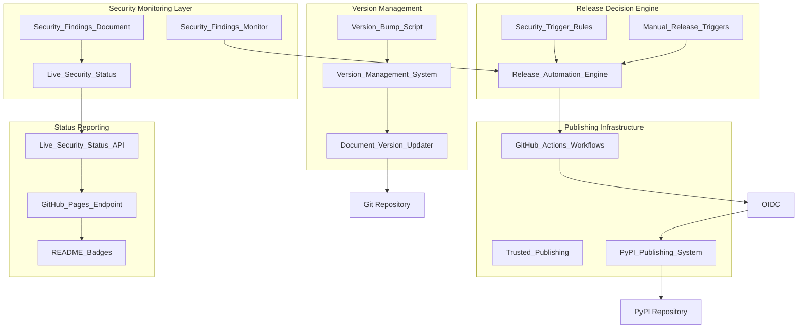

# Design Document

## Overview

Phase 7 implements a sophisticated PyPI publishing system that combines automated security-driven releases with live security status reporting. The system minimizes unnecessary releases while ensuring users always have access to current security information through dynamic status endpoints. The architecture integrates PyPI trusted publishing for secure credential management and builds upon existing CI/CD infrastructure from Phase 3 and security monitoring from Phase 6.

## Architecture

### High-Level System Architecture



### Component Integration Flow

1. **Weekly Security Scans** → Update Live_Security_Status
2. **Security Changes Detected** → Trigger Release_Automation_Engine
3. **Release Decision Made** → Execute PyPI_Publishing_System
4. **Authentication Required** → Use Trusted_Publishing
5. **Status Updates** → Reflect in Live_Security_Status_API
6. **User Visibility** → README badges show current status

## Components and Interfaces

### 1. Release Automation Engine

**Purpose**: Central decision-making component that determines when releases should be triggered based on security findings changes.

**Key Interfaces**:
```yaml
SecurityChangeDetector:
  input: security_findings_diff
  output: release_recommendation
  
ReleaseDecisionMatrix:
  inputs:
    - new_vulnerabilities: boolean
    - resolved_vulnerabilities: boolean
    - severity_changes: list
    - manual_trigger: boolean
  output: release_action
  
ReleaseJustification:
  input: decision_factors
  output: release_notes_content
```

**Decision Logic**:
- **Automatic Release Triggers**:
  - New HIGH/CRITICAL vulnerabilities discovered
  - Vulnerabilities resolved (any severity)
  - Security posture significantly improved
- **Manual Release Triggers**:
  - Code changes or bug fixes
  - Feature additions
  - Dependency updates (non-security)
- **No Release Scenarios**:
  - Weekly scans with no changes
  - Minor security metadata updates
  - Documentation-only changes

### 2. Live Security Status System

**Purpose**: Provides real-time security information independent of package releases.

**Architecture**:
```yaml
StatusDataStore:
  location: security/status/live-status.json
  update_frequency: weekly_scans + on_demand
  
StatusAPI:
  endpoint: https://username.github.io/mypylogger/security-status
  format: JSON + HTML views
  
StatusBadges:
  vulnerability_count: dynamic
  last_scan_date: dynamic
  security_grade: calculated
```

**Data Schema**:
```json
{
  "last_updated": "2025-01-21T10:30:00Z",
  "scan_date": "2025-01-21T09:00:00Z",
  "vulnerability_summary": {
    "total": 0,
    "high": 0,
    "medium": 0,
    "low": 0
  },
  "findings": [],
  "security_grade": "A",
  "days_since_last_vulnerability": 45,
  "remediation_status": "current"
}
```

### 3. Trusted Publishing System

**Purpose**: Secure PyPI publishing without stored secrets in GitHub.

**Configuration**:
```yaml
Trusted_Publishing:
  pypi_environment: "pypi-publishing"
  required_permissions:
    id-token: write
    contents: read
  
PyPI_Configuration:
  publisher: "GitHub Actions"
  repository: "stabbotco1/mypylogger"
  workflow: "pypi-publish.yml"
  environment: "pypi-publishing"
```

**Authentication Flow**:
1. GitHub Actions generates OIDC token
2. PyPI validates GitHub repository identity
3. Direct publishing authorization granted
4. Package uploaded using pypa/gh-action-pypi-publish
5. No credential management required

### 4. PyPI Publishing System

**Purpose**: Reliable package building and publishing with comprehensive validation.

**Workflow Stages**:
```yaml
PrePublishValidation:
  - quality_gates_check
  - security_scan_validation
  - package_integrity_verification
  
PackageBuilding:
  - source_distribution_creation
  - wheel_distribution_creation
  - metadata_validation
  
PublishingExecution:
  - pypi_authentication
  - upload_with_retry_logic
  - publication_verification
  
PostPublishActions:
  - status_update_notification
  - release_notes_generation
  - badge_data_refresh
```

### 5. Version Management System

**Purpose**: Centralized version management with interactive version bumping and automatic document updates.

**CRITICAL IMPLEMENTATION NOTE**: The version management system MUST include test files that contain version assertions. Previous implementation missed test files like `tests/unit/test_core.py` and `tests/unit/test_public_api.py` which contain hardcoded version assertions such as `assert __version__ == "0.2.0"`. When the version bump script runs but doesn't update these test files, the quality gates fail because tests expect the old version. This violates Requirement 8.6 which states that ALL version references must be updated automatically.

**Key Interfaces**:
```yaml
VersionBumpScript:
  input: user_interaction
  output: version_update_complete
  
VersionParser:
  input: pyproject.toml
  output: current_version_info
  
DocumentUpdater:
  inputs:
    - old_version: string
    - new_version: string
    - file_patterns: list
  output: updated_files_list
  
GitIntegration:
  inputs:
    - modified_files: list
    - commit_message: string
    - user_comment: string
  output: commit_and_push_result
```

**Version Management Workflow**:
```yaml
InteractivePrompts:
  - display_current_version
  - request_new_version
  - validate_semantic_versioning
  - request_bump_comment
  
DocumentIdentification:
  - scan_for_version_references
  - identify_update_targets
  - validate_update_patterns
  
VersionUpdate:
  - update_pyproject_toml
  - update_source_code_files
  - update_documentation_files
  - update_configuration_files
  
GitOperations:
  - stage_all_changes
  - create_conventional_commit
  - push_to_remote_main
```

**Supported Version References**:
```yaml
PyProjectToml:
  pattern: 'version = "{version}"'
  file: pyproject.toml
  
SourceCode:
  pattern: '__version__ = "{version}"'
  files: ["src/mypylogger/__init__.py"]
  
Documentation:
  pattern: "mypylogger v{version}"
  files: ["README.md", "docs/**/*.md"]
  
Scripts:
  pattern: "mypylogger v{version}"
  files: ["scripts/**/*.py", "scripts/**/*.sh"]
  
Steering:
  pattern: "mypylogger v{version}"
  files: [".kiro/steering/**/*.md"]
  
TestFiles:
  patterns: 
    - 'assert __version__ == "{version}"'
    - 'assert version == "{version}"'
    - 'assert mypylogger.__version__ == "{version}"'
    - 'assert "mypylogger v{version}" in'
    - "mypylogger v{version}"
  files: 
    - "tests/unit/test_core.py"
    - "tests/unit/test_public_api.py"
    - "tests/performance/__init__.py"
    - "tests/performance/test_benchmarks.py"
    - "tests/**/*test*.py"
  description: "Test files containing version assertions and references"
```

## Data Models

### Security Status Model

```python
@dataclass
class SecurityStatus:
    last_updated: datetime
    scan_date: datetime
    vulnerability_summary: VulnerabilitySummary
    findings: List[SecurityFinding]
    security_grade: str
    days_since_last_vulnerability: int
    remediation_status: str
    
@dataclass
class VulnerabilitySummary:
    total: int
    high: int
    medium: int
    low: int
    
@dataclass
class SecurityFinding:
    finding_id: str
    severity: str
    description: str
    discovered_date: datetime
    days_since_discovery: int
    remediation_plan: Optional[str]
```

### Release Decision Model

```python
@dataclass
class ReleaseDecision:
    should_release: bool
    trigger_type: str  # "security_auto", "manual", "none"
    justification: str
    security_changes: List[SecurityChange]
    release_notes: str
    
@dataclass
class SecurityChange:
    change_type: str  # "new_vulnerability", "resolved", "severity_change"
    finding_id: str
    old_state: Optional[str]
    new_state: str
    impact_level: str
```

### Publishing Configuration Model

```python
@dataclass
class PublishingConfig:
    pypi_repository: str
    aws_role_arn: str
    quality_gates_required: List[str]
    retry_attempts: int
    timeout_seconds: int
    notification_channels: List[str]
```

### Version Management Model

```python
@dataclass
class VersionInfo:
    current_version: str
    major: int
    minor: int
    patch: int
    
@dataclass
class VersionBumpRequest:
    old_version: VersionInfo
    new_version: VersionInfo
    bump_type: str  # "major", "minor", "patch", "custom"
    comment: str
    
@dataclass
class DocumentReference:
    file_path: str
    pattern: str
    line_number: Optional[int]
    content_match: str
    
@dataclass
class VersionUpdateResult:
    success: bool
    updated_files: List[str]
    commit_hash: Optional[str]
    error_message: Optional[str]
```

## Error Handling

### Authentication Failures

```python
class TrustedPublishingError(Exception):
    """Raised when PyPI trusted publishing fails."""
    
def handle_publishing_failure(error: TrustedPublishingError) -> None:
    """
    Handle trusted publishing failures with detailed diagnostics.
    
    Actions:
    1. Log detailed error information
    2. Check PyPI trusted publisher configuration
    3. Verify GitHub repository permissions
    4. Provide actionable remediation steps
    5. Fail workflow with clear error message
    """
```

### Publishing Failures

```python
class PyPIPublishingError(Exception):
    """Raised when PyPI publishing operations fail."""
    
def handle_publishing_failure(error: PyPIPublishingError) -> None:
    """
    Handle PyPI publishing failures with retry logic.
    
    Actions:
    1. Analyze failure cause (network, auth, validation)
    2. Implement exponential backoff retry (3 attempts)
    3. Log detailed failure information
    4. Update status to reflect publishing failure
    5. Send notifications to maintainers
    """
```

### Security Status Update Failures

```python
class SecurityStatusError(Exception):
    """Raised when security status updates fail."""
    
def handle_status_failure(error: SecurityStatusError) -> None:
    """
    Handle security status update failures gracefully.
    
    Actions:
    1. Fall back to previous known good status
    2. Log error for investigation
    3. Continue with other workflow operations
    4. Schedule retry for next scan cycle
    5. Maintain service availability
    """
```

### Version Management Failures

```python
class VersionManagementError(Exception):
    """Raised when version management operations fail."""
    
class InvalidVersionError(VersionManagementError):
    """Raised when version format is invalid."""
    
class DocumentUpdateError(VersionManagementError):
    """Raised when document updates fail."""
    
class IncompleteVersionUpdateError(VersionManagementError):
    """Raised when version update misses files, causing test failures."""
    
def handle_version_bump_failure(error: VersionManagementError) -> None:
    """
    Handle version bump failures with rollback capability.
    
    Actions:
    1. Restore original pyproject.toml from backup
    2. Revert any partially updated documents
    3. Reset Git working directory to clean state
    4. Log detailed error information for debugging
    5. Provide clear error message to user with remediation steps
    """

def validate_version_consistency_post_bump(new_version: str) -> None:
    """
    Validate that all version references were updated after version bump.
    
    CRITICAL: This validation prevents the scenario where version bump
    script runs successfully but test files still contain old version
    assertions, causing quality gate failures.
    
    Actions:
    1. Run quality gates (./scripts/run_tests.sh) after version update
    2. Check for version assertion failures in test files
    3. Scan all project files for remaining old version references
    4. Raise IncompleteVersionUpdateError if inconsistencies found
    5. Provide list of files that still need manual updates
    """
```

## Testing Strategy

### Unit Testing

**Security Status Management**:
```python
def test_security_status_update():
    """Test security status updates with various finding scenarios."""
    
def test_vulnerability_grade_calculation():
    """Test security grade calculation logic."""
    
def test_status_api_response_format():
    """Test API response format and schema validation."""
```

**Version Management**:
```python
def test_version_parsing_from_pyproject():
    """Test version parsing from pyproject.toml file."""
    
def test_semantic_version_validation():
    """Test semantic version format validation and increment logic."""
    
def test_document_version_updates():
    """Test automatic version updates across all project documents."""
    
def test_git_integration_workflow():
    """Test Git staging, committing, and pushing during version bump."""
```

**Release Decision Logic**:
```python
def test_release_decision_matrix():
    """Test release decision logic for various security scenarios."""
    
def test_manual_release_triggers():
    """Test manual release trigger mechanisms."""
    
def test_release_justification_generation():
    """Test automatic release notes generation."""
```

### Integration Testing

**End-to-End Publishing Workflow**:
```python
def test_complete_publishing_workflow():
    """Test complete workflow from security change to PyPI publication."""
    
def test_trusted_publishing_integration():
    """Test PyPI trusted publishing in GitHub Actions environment."""
    
def test_security_status_live_updates():
    """Test live security status updates and API availability."""
```

**Version Management Integration**:
```python
def test_complete_version_bump_workflow():
    """Test complete version bump from user input to Git push."""
    
def test_version_consistency_across_documents():
    """Test that all documents maintain consistent version references."""
    
def test_rollback_on_partial_failure():
    """Test rollback mechanisms when version update partially fails."""
```

### Security Testing

**Authentication Security**:
```python
def test_oidc_token_security():
    """Test OIDC token handling and security measures."""
    
def test_credential_exposure_prevention():
    """Test that no credentials are exposed in logs or artifacts."""
    
def test_publishing_authorization():
    """Test PyPI publishing authorization and scope limitations."""
```

## Performance Considerations

### Workflow Execution Time

**Target Performance**:
- Security status update: < 30 seconds
- Release decision processing: < 10 seconds  
- PyPI publishing (full workflow): < 5 minutes
- Status API response time: < 200ms

**Optimization Strategies**:
- Cache security scan results between workflows
- Parallel execution of independent validation steps
- Incremental status updates (only changed data)
- CDN caching for status API responses

### Resource Usage

**GitHub Actions Minutes**:
- Weekly security scans: ~5 minutes
- Security-driven releases: ~10 minutes
- Manual releases: ~8 minutes
- Estimated monthly usage: ~50 minutes

**Storage Requirements**:
- Security status data: < 1MB
- Historical release data: < 5MB
- Workflow artifacts: < 10MB per release

## Security Considerations

### Credential Management

**Trusted Publishing Security**:
- No credentials stored in GitHub
- Direct OIDC authentication with PyPI
- Repository-specific publishing permissions
- Automatic authentication via GitHub identity

### Publishing Security

**Package Integrity**:
- Cryptographic signing of packages
- Checksum validation before publishing
- Source code integrity verification
- Dependency vulnerability scanning before release

### Status API Security

**Information Disclosure**:
- Public security status (appropriate for open source)
- No sensitive internal information exposed
- Rate limiting on status API endpoints
- HTTPS-only access for all endpoints

## Deployment Strategy

### Phase 7A: Basic PyPI Publishing Infrastructure

1. **GitHub Actions Workflow Creation**
   - Manual PyPI publishing workflow
   - Quality gate integration
   - Basic error handling and logging

2. **Package Building Pipeline**
   - Source and wheel distribution creation
   - Metadata validation
   - Pre-publish quality checks

### Phase 7B: Trusted Publishing Setup

1. **PyPI Configuration**
   - Trusted publisher setup for GitHub repository
   - Workflow and environment configuration
   - Repository permissions validation

2. **GitHub Actions Integration**
   - Trusted publishing workflow integration
   - OIDC permissions configuration
   - Error handling for publishing failures

### Phase 7C: Security-Driven Automation

1. **Release Decision Engine**
   - Security change detection logic
   - Automated release trigger implementation
   - Release justification and notes generation

2. **Integration with Phase 6 Security System**
   - Security findings monitoring integration
   - Automated workflow triggers
   - Status synchronization

### Phase 7D: Live Security Status Integration

1. **Status API Development**
   - GitHub Pages deployment
   - JSON API endpoint creation
   - Badge data generation

2. **README Integration**
   - Dynamic badge implementation
   - Status link integration
   - Documentation updates

### Phase 7E: Version Management System

1. **Interactive Version Bump Script**
   - Command-line interface development
   - Version parsing and validation logic
   - User interaction and input validation

2. **Document Update Automation**
   - Version reference scanning and identification
   - Automatic document update mechanisms
   - Consistency validation across all files

3. **Git Integration**
   - Automated staging and commit creation
   - Conventional commit message formatting
   - Remote push with error handling and rollback

## Monitoring and Observability

### Workflow Monitoring

**Key Metrics**:
- Release frequency and triggers
- Publishing success/failure rates
- Authentication success rates
- Security status update frequency

**Alerting**:
- Publishing failures
- Authentication errors
- Security status update failures
- Unusual release patterns

### Status API Monitoring

**Availability Metrics**:
- API response time
- Uptime percentage
- Error rates
- Cache hit rates

**Usage Analytics**:
- Badge request frequency
- Status page views
- API endpoint usage patterns