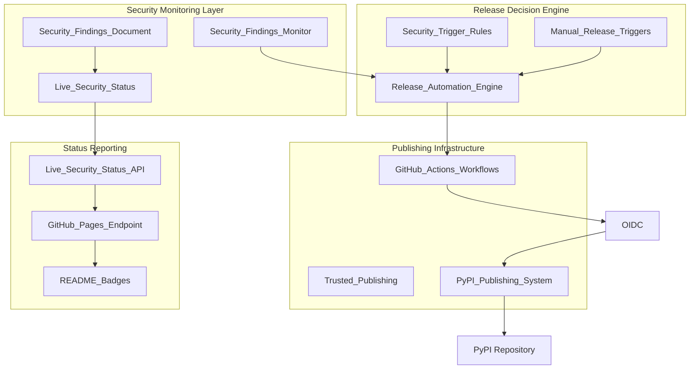

# Design Document

## Overview

Phase 7 implements a sophisticated PyPI publishing system that combines automated security-driven releases with live security status reporting. The system minimizes unnecessary releases while ensuring users always have access to current security information through dynamic status endpoints. The architecture integrates PyPI trusted publishing for secure credential management and builds upon existing CI/CD infrastructure from Phase 3 and security monitoring from Phase 6.

## Architecture

### High-Level System Architecture



### Component Integration Flow

1. **Weekly Security Scans** → Update Live_Security_Status
2. **Security Changes Detected** → Trigger Release_Automation_Engine
3. **Release Decision Made** → Execute PyPI_Publishing_System
4. **Authentication Required** → Use Trusted_Publishing
5. **Status Updates** → Reflect in Live_Security_Status_API
6. **User Visibility** → README badges show current status

## Components and Interfaces

### 1. Release Automation Engine

**Purpose**: Central decision-making component that determines when releases should be triggered based on security findings changes.

**Key Interfaces**:
```yaml
SecurityChangeDetector:
  input: security_findings_diff
  output: release_recommendation
  
ReleaseDecisionMatrix:
  inputs:
    - new_vulnerabilities: boolean
    - resolved_vulnerabilities: boolean
    - severity_changes: list
    - manual_trigger: boolean
  output: release_action
  
ReleaseJustification:
  input: decision_factors
  output: release_notes_content
```

**Decision Logic**:
- **Automatic Release Triggers**:
  - New HIGH/CRITICAL vulnerabilities discovered
  - Vulnerabilities resolved (any severity)
  - Security posture significantly improved
- **Manual Release Triggers**:
  - Code changes or bug fixes
  - Feature additions
  - Dependency updates (non-security)
- **No Release Scenarios**:
  - Weekly scans with no changes
  - Minor security metadata updates
  - Documentation-only changes

### 2. Live Security Status System

**Purpose**: Provides real-time security information independent of package releases.

**Architecture**:
```yaml
StatusDataStore:
  location: security/status/live-status.json
  update_frequency: weekly_scans + on_demand
  
StatusAPI:
  endpoint: https://username.github.io/mypylogger/security-status
  format: JSON + HTML views
  
StatusBadges:
  vulnerability_count: dynamic
  last_scan_date: dynamic
  security_grade: calculated
```

**Data Schema**:
```json
{
  "last_updated": "2025-01-21T10:30:00Z",
  "scan_date": "2025-01-21T09:00:00Z",
  "vulnerability_summary": {
    "total": 0,
    "high": 0,
    "medium": 0,
    "low": 0
  },
  "findings": [],
  "security_grade": "A",
  "days_since_last_vulnerability": 45,
  "remediation_status": "current"
}
```

### 3. Trusted Publishing System

**Purpose**: Secure PyPI publishing without stored secrets in GitHub.

**Configuration**:
```yaml
Trusted_Publishing:
  pypi_environment: "pypi-publishing"
  required_permissions:
    id-token: write
    contents: read
  
PyPI_Configuration:
  publisher: "GitHub Actions"
  repository: "stabbotco1/mypylogger"
  workflow: "pypi-publish.yml"
  environment: "pypi-publishing"
```

**Authentication Flow**:
1. GitHub Actions generates OIDC token
2. PyPI validates GitHub repository identity
3. Direct publishing authorization granted
4. Package uploaded using pypa/gh-action-pypi-publish
5. No credential management required

### 4. PyPI Publishing System

**Purpose**: Reliable package building and publishing with comprehensive validation.

**Workflow Stages**:
```yaml
PrePublishValidation:
  - quality_gates_check
  - security_scan_validation
  - package_integrity_verification
  
PackageBuilding:
  - source_distribution_creation
  - wheel_distribution_creation
  - metadata_validation
  
PublishingExecution:
  - pypi_authentication
  - upload_with_retry_logic
  - publication_verification
  
PostPublishActions:
  - status_update_notification
  - release_notes_generation
  - badge_data_refresh
```

## Data Models

### Security Status Model

```python
@dataclass
class SecurityStatus:
    last_updated: datetime
    scan_date: datetime
    vulnerability_summary: VulnerabilitySummary
    findings: List[SecurityFinding]
    security_grade: str
    days_since_last_vulnerability: int
    remediation_status: str
    
@dataclass
class VulnerabilitySummary:
    total: int
    high: int
    medium: int
    low: int
    
@dataclass
class SecurityFinding:
    finding_id: str
    severity: str
    description: str
    discovered_date: datetime
    days_since_discovery: int
    remediation_plan: Optional[str]
```

### Release Decision Model

```python
@dataclass
class ReleaseDecision:
    should_release: bool
    trigger_type: str  # "security_auto", "manual", "none"
    justification: str
    security_changes: List[SecurityChange]
    release_notes: str
    
@dataclass
class SecurityChange:
    change_type: str  # "new_vulnerability", "resolved", "severity_change"
    finding_id: str
    old_state: Optional[str]
    new_state: str
    impact_level: str
```

### Publishing Configuration Model

```python
@dataclass
class PublishingConfig:
    pypi_repository: str
    aws_role_arn: str
    quality_gates_required: List[str]
    retry_attempts: int
    timeout_seconds: int
    notification_channels: List[str]
```

## Error Handling

### Authentication Failures

```python
class TrustedPublishingError(Exception):
    """Raised when PyPI trusted publishing fails."""
    
def handle_publishing_failure(error: TrustedPublishingError) -> None:
    """
    Handle trusted publishing failures with detailed diagnostics.
    
    Actions:
    1. Log detailed error information
    2. Check PyPI trusted publisher configuration
    3. Verify GitHub repository permissions
    4. Provide actionable remediation steps
    5. Fail workflow with clear error message
    """
```

### Publishing Failures

```python
class PyPIPublishingError(Exception):
    """Raised when PyPI publishing operations fail."""
    
def handle_publishing_failure(error: PyPIPublishingError) -> None:
    """
    Handle PyPI publishing failures with retry logic.
    
    Actions:
    1. Analyze failure cause (network, auth, validation)
    2. Implement exponential backoff retry (3 attempts)
    3. Log detailed failure information
    4. Update status to reflect publishing failure
    5. Send notifications to maintainers
    """
```

### Security Status Update Failures

```python
class SecurityStatusError(Exception):
    """Raised when security status updates fail."""
    
def handle_status_failure(error: SecurityStatusError) -> None:
    """
    Handle security status update failures gracefully.
    
    Actions:
    1. Fall back to previous known good status
    2. Log error for investigation
    3. Continue with other workflow operations
    4. Schedule retry for next scan cycle
    5. Maintain service availability
    """
```

## Testing Strategy

### Unit Testing

**Security Status Management**:
```python
def test_security_status_update():
    """Test security status updates with various finding scenarios."""
    
def test_vulnerability_grade_calculation():
    """Test security grade calculation logic."""
    
def test_status_api_response_format():
    """Test API response format and schema validation."""
```

**Release Decision Logic**:
```python
def test_release_decision_matrix():
    """Test release decision logic for various security scenarios."""
    
def test_manual_release_triggers():
    """Test manual release trigger mechanisms."""
    
def test_release_justification_generation():
    """Test automatic release notes generation."""
```

### Integration Testing

**End-to-End Publishing Workflow**:
```python
def test_complete_publishing_workflow():
    """Test complete workflow from security change to PyPI publication."""
    
def test_trusted_publishing_integration():
    """Test PyPI trusted publishing in GitHub Actions environment."""
    
def test_security_status_live_updates():
    """Test live security status updates and API availability."""
```

### Security Testing

**Authentication Security**:
```python
def test_oidc_token_security():
    """Test OIDC token handling and security measures."""
    
def test_credential_exposure_prevention():
    """Test that no credentials are exposed in logs or artifacts."""
    
def test_publishing_authorization():
    """Test PyPI publishing authorization and scope limitations."""
```

## Performance Considerations

### Workflow Execution Time

**Target Performance**:
- Security status update: < 30 seconds
- Release decision processing: < 10 seconds  
- PyPI publishing (full workflow): < 5 minutes
- Status API response time: < 200ms

**Optimization Strategies**:
- Cache security scan results between workflows
- Parallel execution of independent validation steps
- Incremental status updates (only changed data)
- CDN caching for status API responses

### Resource Usage

**GitHub Actions Minutes**:
- Weekly security scans: ~5 minutes
- Security-driven releases: ~10 minutes
- Manual releases: ~8 minutes
- Estimated monthly usage: ~50 minutes

**Storage Requirements**:
- Security status data: < 1MB
- Historical release data: < 5MB
- Workflow artifacts: < 10MB per release

## Security Considerations

### Credential Management

**Trusted Publishing Security**:
- No credentials stored in GitHub
- Direct OIDC authentication with PyPI
- Repository-specific publishing permissions
- Automatic authentication via GitHub identity

### Publishing Security

**Package Integrity**:
- Cryptographic signing of packages
- Checksum validation before publishing
- Source code integrity verification
- Dependency vulnerability scanning before release

### Status API Security

**Information Disclosure**:
- Public security status (appropriate for open source)
- No sensitive internal information exposed
- Rate limiting on status API endpoints
- HTTPS-only access for all endpoints

## Deployment Strategy

### Phase 7A: Basic PyPI Publishing Infrastructure

1. **GitHub Actions Workflow Creation**
   - Manual PyPI publishing workflow
   - Quality gate integration
   - Basic error handling and logging

2. **Package Building Pipeline**
   - Source and wheel distribution creation
   - Metadata validation
   - Pre-publish quality checks

### Phase 7B: Trusted Publishing Setup

1. **PyPI Configuration**
   - Trusted publisher setup for GitHub repository
   - Workflow and environment configuration
   - Repository permissions validation

2. **GitHub Actions Integration**
   - Trusted publishing workflow integration
   - OIDC permissions configuration
   - Error handling for publishing failures

### Phase 7C: Security-Driven Automation

1. **Release Decision Engine**
   - Security change detection logic
   - Automated release trigger implementation
   - Release justification and notes generation

2. **Integration with Phase 6 Security System**
   - Security findings monitoring integration
   - Automated workflow triggers
   - Status synchronization

### Phase 7D: Live Security Status Integration

1. **Status API Development**
   - GitHub Pages deployment
   - JSON API endpoint creation
   - Badge data generation

2. **README Integration**
   - Dynamic badge implementation
   - Status link integration
   - Documentation updates

## Monitoring and Observability

### Workflow Monitoring

**Key Metrics**:
- Release frequency and triggers
- Publishing success/failure rates
- Authentication success rates
- Security status update frequency

**Alerting**:
- Publishing failures
- Authentication errors
- Security status update failures
- Unusual release patterns

### Status API Monitoring

**Availability Metrics**:
- API response time
- Uptime percentage
- Error rates
- Cache hit rates

**Usage Analytics**:
- Badge request frequency
- Status page views
- API endpoint usage patterns