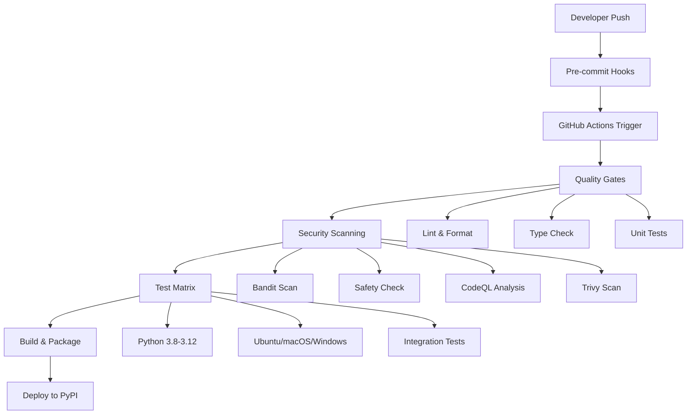
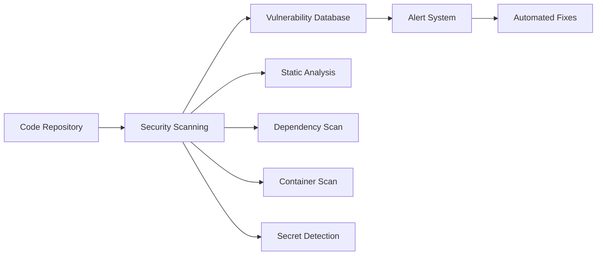

# Project Maturation Design

## Overview

This document outlines the design for transforming mypylogger from a proof-of-concept into a production-ready open-source library with comprehensive CI/CD, security scanning, quality assurance, and community contribution frameworks.

## Architecture

### CI/CD Pipeline Architecture



### Security Architecture



## Components and Interfaces

### GitHub Actions Workflows

#### Primary Workflow: `.github/workflows/ci.yml`
```yaml
name: CI/CD Pipeline
on: [push, pull_request]
jobs:
  quality-gates:
    runs-on: ubuntu-latest
    steps:
      - uses: actions/checkout@v4
      - name: Setup Python
        uses: actions/setup-python@v4
      - name: Install dependencies
        run: pip install -e ".[dev]"
      - name: Run quality checks
        run: make lint test-coverage
        
  security-scan:
    runs-on: ubuntu-latest
    steps:
      - uses: actions/checkout@v4
      - name: Run security scans
        run: make security-scan
        
  test-matrix:
    strategy:
      matrix:
        python-version: [3.8, 3.9, 3.10, 3.11, 3.12]
        os: [ubuntu-latest, macos-latest, windows-latest]
    runs-on: ${{ matrix.os }}
    steps:
      - name: Test on ${{ matrix.python-version }}
        run: make test-all
```

#### Security Workflow: `.github/workflows/security.yml`
```yaml
name: Security Scanning
on:
  schedule:
    - cron: '0 2 * * *'  # Daily at 2 AM
  push:
    branches: [main, pre-release]
jobs:
  security-scan:
    runs-on: ubuntu-latest
    steps:
      - name: CodeQL Analysis
        uses: github/codeql-action/analyze@v2
      - name: Trivy Vulnerability Scanner
        uses: aquasecurity/trivy-action@master
      - name: Upload results to GitHub Security
        uses: github/codeql-action/upload-sarif@v2
```

### Badge Integration System

#### Badge Configuration
```markdown
<!-- README.md badge section -->
[](https://github.com/stabbotco1/mypylogger/actions)
[](https://codecov.io/gh/stabbotco1/mypylogger)
[](https://sonarcloud.io/dashboard?id=mypylogger)
[](https://sonarcloud.io/dashboard?id=mypylogger)
[](https://opensource.org/licenses/MIT)
[](https://badge.fury.io/py/mypylogger)
[](https://pypi.org/project/mypylogger/)
[](https://pepy.tech/project/mypylogger)
```

### Security Scanning Integration

#### Multi-Tool Security Strategy
1. **Bandit**: Python-specific security linting
2. **Safety**: Dependency vulnerability scanning
3. **CodeQL**: GitHub's semantic code analysis
4. **Trivy**: Comprehensive vulnerability scanner
5. **Semgrep**: Custom security rule engine

#### Security Tool Configuration
```yaml
# .bandit
[bandit]
exclude_dirs = ["tests", "build", "dist"]
skips = ["B101"]  # Skip assert_used test

# .safety-policy.yml
security:
  ignore-vulnerabilities:
    # Temporarily ignore specific CVEs with justification
    - id: 12345
      reason: "False positive - not applicable to our usage"
      expires: "2024-12-31"
```

## Data Models

### Project Configuration Model

#### pyproject.toml Structure
```toml
[build-system]
requires = ["setuptools>=61.0", "wheel"]
build-backend = "setuptools.build_meta"

[project]
name = "mypylogger"
version = "0.1.0"
description = "Production-ready Python logging with JSON formatting"
authors = [{name = "Author Name", email = "author@example.com"}]
license = {text = "MIT"}
readme = "README.md"
requires-python = ">=3.8"
dependencies = ["python-json-logger>=2.0.0"]

[project.optional-dependencies]
dev = [
    "pytest>=7.0.0",
    "pytest-cov>=4.0.0",
    "black>=23.0.0",
    "isort>=5.12.0",
    "flake8>=6.0.0",
    "mypy>=1.0.0",
    "bandit>=1.7.0",
    "safety>=2.3.0",
    "pre-commit>=3.0.0"
]

[project.urls]
Homepage = "https://github.com/stabbotco1/mypylogger"
Repository = "https://github.com/stabbotco1/mypylogger"
Documentation = "https://github.com/stabbotco1/mypylogger#readme"
"Bug Tracker" = "https://github.com/stabbotco1/mypylogger/issues"

[tool.pytest.ini_options]
testpaths = ["tests"]
python_files = ["test_*.py"]
python_classes = ["Test*"]
python_functions = ["test_*"]
addopts = "--cov=mypylogger --cov-report=html --cov-report=term-missing --cov-fail-under=90"

[tool.black]
line-length = 88
target-version = ['py38']

[tool.isort]
profile = "black"
multi_line_output = 3

[tool.mypy]
python_version = "3.8"
warn_return_any = true
warn_unused_configs = true
disallow_untyped_defs = true
```

### Vulnerability Tracking Model

#### VULNERABILITIES.md Structure
```markdown
# Known Vulnerabilities

## Current Status: ✅ CLEAN

Last Updated: 2024-01-15
Last Scan: 2024-01-15 10:30 UTC

## Vulnerability History

### Resolved Vulnerabilities

#### CVE-2023-12345 (Resolved)
- **Severity**: Medium
- **Component**: python-json-logger < 2.0.5
- **Description**: Potential log injection vulnerability
- **Resolution**: Updated to python-json-logger 2.0.7
- **Resolved Date**: 2024-01-10
- **Fix Version**: 0.1.2

## Scanning Tools

- **Bandit**: Python security linter
- **Safety**: Dependency vulnerability scanner
- **CodeQL**: Semantic code analysis
- **Trivy**: Container and filesystem scanner
- **Semgrep**: Custom security rules

## Reporting Process

To report a security vulnerability:
1. Email: security@example.com
2. Include: Detailed description and reproduction steps
3. Response: Within 48 hours
4. Disclosure: Coordinated disclosure after fix
```

## Error Handling

### CI/CD Error Handling
- **Pipeline Failures**: Automatic retry with exponential backoff
- **Test Failures**: Detailed failure reports with logs
- **Security Scan Failures**: Block deployment and alert maintainers
- **Deployment Failures**: Automatic rollback to previous version

### Security Error Handling
- **Vulnerability Detection**: Immediate alert and deployment block
- **False Positives**: Documented exceptions with expiration dates
- **Critical Vulnerabilities**: Emergency hotfix process
- **Dependency Issues**: Automated dependency updates where possible

## Testing Strategy

### Automated Testing Levels

#### Unit Tests (Fast - <1s)
- Core functionality validation
- Mocked external dependencies
- 100% coverage of critical paths

#### Integration Tests (Medium - <30s)
- Component interaction validation
- Real dependency integration
- End-to-end workflow testing

#### Security Tests (Medium - <60s)
- Vulnerability scanning
- Penetration testing scenarios
- Security policy validation

#### Performance Tests (Slow - <5min)
- Latency benchmarking
- Throughput validation
- Memory usage monitoring
- Load testing scenarios

### Test Automation Strategy

#### Continuous Testing
```bash
# Local development
pytest-watch --clear --onpass --onfail

# CI/CD pipeline
pytest --cov=mypylogger --cov-report=xml --cov-fail-under=90
```

#### Performance Benchmarking
```python
def test_logging_performance():
    """Ensure logging performance meets requirements."""
    logger = SingletonLogger.get_logger()
    
    # Test latency requirement (<1ms per log)
    start = time.perf_counter()
    logger.info("Performance test")
    latency = time.perf_counter() - start
    assert latency < 0.001
    
    # Test throughput requirement (>10,000 logs/second)
    start = time.perf_counter()
    for _ in range(10000):
        logger.info("Throughput test")
    duration = time.perf_counter() - start
    assert duration < 1.0
```

## Deployment Strategy

### PyPI Publication Process

#### Automated Release Pipeline
1. **Tag Creation**: Developer creates semantic version tag
2. **Validation**: Full test suite and security scan
3. **Build**: Create source and wheel distributions
4. **Upload**: Publish to PyPI using API token
5. **Verification**: Install and test published package
6. **Documentation**: Update hosted documentation

#### Release Validation
```yaml
# Release validation workflow
- name: Validate Release
  run: |
    pip install mypylogger==${{ github.ref_name }}
    python -c "import mypylogger; print('Import successful')"
    python -c "from mypylogger import SingletonLogger; logger = SingletonLogger.get_logger(); logger.info('Test')"
```

### Documentation Deployment

#### Automated Documentation Updates
- **API Documentation**: Auto-generated from docstrings
- **Usage Examples**: Validated example code
- **Security Documentation**: Current vulnerability status
- **Contribution Guidelines**: Up-to-date process documentation

## Monitoring and Alerting

### Health Monitoring
- **Build Status**: Real-time pipeline status
- **Security Posture**: Daily vulnerability scans
- **Performance Metrics**: Continuous performance monitoring
- **Usage Analytics**: PyPI download statistics

### Alert Configuration
- **Critical Failures**: Immediate Slack/email alerts
- **Security Issues**: High-priority security team alerts
- **Performance Degradation**: Development team notifications
- **Dependency Updates**: Weekly dependency status reports