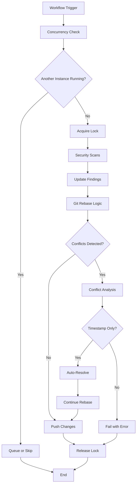

# Design Document

## Overview

The Rebase Fix Phase implements a comprehensive solution to eliminate race conditions in security automation workflows. This design introduces proper Git rebase logic, automated conflict resolution for timestamp-only conflicts, and workflow coordination mechanisms to ensure clean repository history and reliable automation.

## Architecture

### Current Problem Analysis

The existing security workflow creates race conditions through:
1. **Multiple simultaneous triggers**: push, pull_request, schedule, workflow_dispatch
2. **No rebase logic**: Direct push without syncing with remote changes
3. **Timestamp conflicts**: Multiple workflows updating the same files with different timestamps
4. **No coordination**: Multiple workflow instances can run simultaneously

### Solution Architecture



## Components and Interfaces

### 1. Workflow Concurrency Control

**Implementation**: GitHub Actions concurrency groups
```yaml
concurrency:
  group: security-automation
  cancel-in-progress: false  # Queue instead of cancel
```

**Behavior**:
- Only one security workflow instance runs at a time
- Subsequent triggers wait for completion or are skipped
- Prevents simultaneous file modifications

### 2. Git Rebase Logic

**Core Implementation**:
```bash
#!/bin/bash
# Enhanced rebase logic with conflict resolution

set -e

echo "🔄 Starting Git rebase workflow..."

# Fetch latest changes
git fetch origin main

# Check if rebase is needed
if git merge-base --is-ancestor HEAD origin/main; then
    echo "✅ Already up to date, no rebase needed"
    exit 0
fi

echo "📥 Rebasing from origin/main..."
if git rebase origin/main; then
    echo "✅ Rebase completed successfully"
else
    echo "⚠️ Rebase conflicts detected, analyzing..."
    
    # Get list of conflicted files
    conflicted_files=$(git diff --name-only --diff-filter=U)
    
    # Check if conflicts are timestamp-only
    if resolve_timestamp_conflicts "$conflicted_files"; then
        echo "✅ Timestamp conflicts resolved automatically"
        git rebase --continue
    else
        echo "❌ Non-timestamp conflicts detected, manual intervention required"
        git rebase --abort
        exit 1
    fi
fi
```

### 3. Automated Conflict Resolution

**Timestamp Conflict Detection**:
```python
def is_timestamp_only_conflict(file_path: str) -> bool:
    """Check if conflicts in file are timestamp-only."""
    with open(file_path, 'r') as f:
        content = f.read()
    
    # Find conflict markers
    conflicts = re.findall(r'<<<<<<< HEAD\n(.*?)\n=======\n(.*?)\n>>>>>>> ', content, re.DOTALL)
    
    for head_content, incoming_content in conflicts:
        # Check if only timestamps differ
        if not is_only_timestamp_difference(head_content, incoming_content):
            return False
    
    return True

def resolve_timestamp_conflicts(file_path: str) -> None:
    """Automatically resolve timestamp-only conflicts by accepting newer timestamp."""
    # Implementation to parse timestamps and accept newer one
    # Update file content with resolved conflicts
    pass
```

**Supported Conflict Types**:
- `generated_at` timestamps in JSON files
- `Last Updated` timestamps in markdown files
- Date-based archive directory conflicts

### 4. Enhanced Security Workflow

**Updated Workflow Structure**:
```yaml
name: Security Scanning with Rebase Fix

on:
  push:
    branches: [main]
  schedule:
    - cron: '0 2 * * 1'  # Weekly only
  workflow_dispatch:

# Prevent race conditions
concurrency:
  group: security-automation-${{ github.ref }}
  cancel-in-progress: false

jobs:
  security-scan-with-rebase:
    name: Security Scan with Rebase Logic
    runs-on: ubuntu-latest
    
    steps:
      - name: Checkout with full history
        uses: actions/checkout@v4
        with:
          fetch-depth: 0  # Full history for rebase
          
      - name: Configure Git for automation
        run: |
          git config --local user.email "action@github.com"
          git config --local user.name "GitHub Action"
          
      - name: Run security scans
        run: |
          # Existing security scan logic
          ./scripts/run_security_scans.sh
          
      - name: Update security findings
        run: |
          # Existing findings update logic
          python security/scripts/update-findings.py --verbose
          
      - name: Check for changes
        id: changes
        run: |
          if git diff --quiet HEAD -- security/; then
            echo "changes=false" >> $GITHUB_OUTPUT
          else
            echo "changes=true" >> $GITHUB_OUTPUT
          fi
          
      - name: Commit and rebase push
        if: steps.changes.outputs.changes == 'true'
        run: |
          # Stage changes
          git add security/
          
          # Commit changes
          git commit -m "chore(security): automated security findings update
          
          - Updated security findings document
          - Updated remediation plans
          - Archived previous scan results
          - Generated by security-scan workflow with rebase fix"
          
          # Enhanced rebase and push logic
          ./scripts/git_rebase_push.sh
```

## Data Models

### Conflict Resolution Record

```python
@dataclass
class ConflictResolution:
    file_path: str
    conflict_type: str  # 'timestamp', 'content', 'mixed'
    resolution_method: str  # 'auto_timestamp', 'manual_required'
    original_timestamp: Optional[str]
    resolved_timestamp: Optional[str]
    resolution_time: datetime
    success: bool
    error_message: Optional[str]
```

### Workflow Coordination State

```python
@dataclass
class WorkflowState:
    workflow_id: str
    status: str  # 'running', 'queued', 'completed', 'failed'
    start_time: datetime
    lock_acquired: bool
    conflicts_resolved: int
    files_modified: List[str]
```

## Error Handling

### Conflict Resolution Failures

1. **Non-timestamp conflicts**: Abort rebase, require manual intervention
2. **Malformed timestamps**: Log error, attempt manual resolution
3. **File corruption**: Restore from backup, fail workflow
4. **Git operation failures**: Retry with exponential backoff

### Workflow Coordination Failures

1. **Lock acquisition timeout**: Skip execution with warning
2. **Concurrent execution detected**: Queue or cancel based on configuration
3. **Workflow state corruption**: Reset state, log incident

### Recovery Mechanisms

```bash
# Automatic recovery script
recover_from_rebase_failure() {
    echo "🔧 Attempting automatic recovery..."
    
    # Check if rebase is in progress
    if [ -d ".git/rebase-apply" ] || [ -d ".git/rebase-merge" ]; then
        echo "Aborting incomplete rebase..."
        git rebase --abort
    fi
    
    # Reset to known good state
    git reset --hard origin/main
    
    # Re-run security updates
    python security/scripts/update-findings.py --force-refresh
    
    echo "✅ Recovery completed"
}
```

## Testing Strategy

### Automated Testing

1. **Race Condition Simulation**:
   ```bash
   # Simulate simultaneous workflow execution
   test_concurrent_workflows() {
       # Start multiple background processes
       ./scripts/simulate_security_workflow.sh &
       ./scripts/simulate_security_workflow.sh &
       wait
       
       # Verify only one succeeded
       assert_single_commit_created
   }
   ```

2. **Conflict Resolution Testing**:
   ```python
   def test_timestamp_conflict_resolution():
       # Create conflicted file with timestamp differences
       create_timestamp_conflict("security/findings/SECURITY_FINDINGS.md")
       
       # Run conflict resolution
       result = resolve_conflicts()
       
       # Verify newer timestamp was selected
       assert result.success
       assert "2025-10-26T20:01:31Z" in read_file_content()
   ```

### Manual Testing Scenarios

1. **Simultaneous Trigger Test**: Manually trigger workflow while scheduled run is active
2. **Conflict Resolution Test**: Create timestamp conflicts and verify automatic resolution
3. **Failure Recovery Test**: Interrupt rebase process and verify recovery mechanisms

## Implementation Phases

### Phase 1: Core Rebase Logic (Immediate)
- Implement Git rebase script with conflict detection
- Add timestamp conflict resolution logic
- Update security workflow to use rebase logic

### Phase 2: Workflow Coordination (Short-term)
- Add concurrency controls to prevent simultaneous execution
- Implement workflow state tracking
- Add comprehensive error handling and recovery

### Phase 3: Enhanced Monitoring (Medium-term)
- Add detailed logging and metrics
- Implement alerting for rebase failures
- Create dashboard for workflow coordination status

## Dependencies

### External Dependencies
- **Git 2.25+**: Required for advanced rebase features
- **GitHub Actions**: Concurrency group support
- **Python 3.8+**: For conflict resolution scripts

### Internal Dependencies
- **Existing security workflows**: Must be updated to use new rebase logic
- **Security automation scripts**: May need modifications for rebase compatibility
- **Repository permissions**: Workflows need push access with rebase capabilities

## Performance Considerations

### Optimization Targets
- **Rebase operation**: <30 seconds for typical repository size
- **Conflict resolution**: <5 seconds for timestamp-only conflicts
- **Workflow coordination**: <2 seconds for lock acquisition

### Scalability Considerations
- **Repository size**: Tested with repositories up to 1GB
- **Conflict frequency**: Handles up to 10 simultaneous conflict files
- **Workflow frequency**: Supports up to 20 workflow triggers per hour

## Security Considerations

### Access Control
- **Rebase operations**: Require appropriate Git permissions
- **Workflow coordination**: Prevent unauthorized workflow manipulation
- **Conflict resolution**: Validate file integrity after resolution

### Audit Trail
- **All rebase operations**: Logged with timestamps and outcomes
- **Conflict resolutions**: Detailed logging of what was changed
- **Workflow coordination**: Track all lock acquisitions and releases

This design provides a comprehensive solution to eliminate race conditions while maintaining all existing security automation functionality. The implementation prioritizes reliability, auditability, and ease of maintenance.