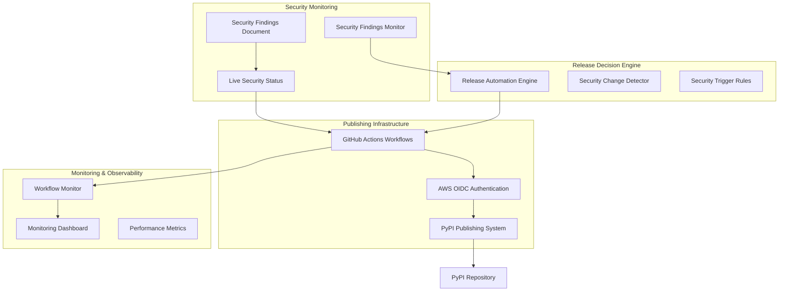

# Phase 7: PyPI Publishing System Documentation

## Overview

Phase 7 implements a comprehensive PyPI publishing system with security-driven automation for mypylogger v0.2.0. This system provides automated PyPI publishing workflows triggered by security findings changes, while maintaining manual control for code releases and offering live security status reporting.

## Architecture

### System Components



### Key Features

1. **Security-Driven Automation**: Releases triggered by security findings changes
2. **Live Security Status**: Real-time security information independent of releases
3. **AWS OIDC Authentication**: Secure credential management without stored secrets
4. **Comprehensive Monitoring**: Workflow execution tracking and performance metrics
5. **Manual Override**: Manual release capability with security status updates

## Components

### 1. Integration Orchestrator (`scripts/integration_orchestrator.py`)

The main coordination component that connects all Phase 7 systems.

**Key Methods:**
- `execute_security_driven_workflow()`: Automated security-driven releases
- `execute_manual_release_workflow()`: Manual releases with status updates
- `validate_integration_health()`: System health monitoring
- `get_monitoring_dashboard()`: Dashboard data generation

**Usage:**
```bash
# Security-driven workflow
uv run python scripts/integration_orchestrator.py security-workflow

# Manual release
uv run python scripts/integration_orchestrator.py manual-workflow --notes="Release notes"

# Health check
uv run python scripts/integration_orchestrator.py health-check

# Monitoring dashboard
uv run python scripts/integration_orchestrator.py dashboard
```

### 2. Release Automation Engine (`scripts/release_automation_engine.py`)

Implements the decision logic for when releases should be triggered.

**Decision Matrix:**
- **Automatic Release Triggers**: HIGH/CRITICAL vulnerabilities, vulnerability resolutions
- **Manual Release Triggers**: Code changes, feature additions, manual requests
- **No Release Scenarios**: Weekly scans with no changes, minor metadata updates

**Key Classes:**
- `ReleaseAutomationEngine`: Main decision engine
- `ReleaseDecisionMatrix`: Decision logic implementation
- `ReleaseJustificationGenerator`: Release notes generation

### 3. Security Change Detector (`scripts/security_change_detector.py`)

Detects changes in security findings over time to trigger releases.

**Change Types:**
- `NEW_VULNERABILITY`: New security issues discovered
- `RESOLVED_VULNERABILITY`: Security issues fixed
- `SEVERITY_CHANGE`: Changes in vulnerability severity
- `NO_CHANGE`: No security changes detected

### 4. Workflow Monitoring (`scripts/workflow_monitoring.py`)

Comprehensive monitoring and metrics collection for all workflows.

**Features:**
- Workflow execution tracking
- Publishing success/failure rates
- Performance metrics collection
- HTML dashboard generation

**Usage:**
```bash
# Generate monitoring dashboard
uv run python scripts/workflow_monitoring.py dashboard

# View publishing statistics
uv run python scripts/workflow_monitoring.py stats --days=30

# Check system health
uv run python scripts/workflow_monitoring.py health
```

### 5. Security & Performance Validator (`scripts/security_performance_validator.py`)

Validates security requirements (OIDC authentication) and performance targets.

**Security Validations:**
- OIDC configuration validation
- Credential security checks
- Publishing authorization verification

**Performance Validations:**
- API response time validation (< 200ms target)
- Workflow execution time validation (< 5 minutes target)
- Status API performance testing

**Usage:**
```bash
# Complete validation
uv run python scripts/security_performance_validator.py validate

# Security validation only
uv run python scripts/security_performance_validator.py security

# Performance validation only
uv run python scripts/security_performance_validator.py performance
```

### 6. Live Security Status (`badges/live_status.py`)

Provides real-time security status reporting independent of package releases.

**Features:**
- JSON API endpoint for programmatic access
- HTML status page for human consumption
- Security grade calculation (A-D scale)
- Vulnerability summary by severity
- Days since last vulnerability tracking

**Output Locations:**
- JSON API: `docs/security-status/index.json`
- HTML Page: `docs/security-status/index.html`

## GitHub Actions Workflows

### 1. Security-Driven Release (`.github/workflows/security-driven-release.yml`)

Automated workflow that runs weekly and on-demand to check for security changes and trigger releases.

**Triggers:**
- Weekly schedule (Mondays at 3 AM UTC)
- Manual workflow dispatch with options

**Process:**
1. Run security scans (bandit, pip-audit)
2. Update security findings document
3. Analyze security changes for release decision
4. Trigger PyPI publishing if needed
5. Update live security status

### 2. PyPI Publishing (`.github/workflows/pypi-publish.yml`)

Comprehensive PyPI publishing workflow with quality gates and OIDC authentication.

**Features:**
- Quality gate validation (tests, linting, security)
- Package building and validation
- AWS OIDC authentication for secure publishing
- Comprehensive error handling and retry logic
- Live security status updates after publishing

**Triggers:**
- Manual workflow dispatch
- Automated trigger from security-driven release

### 3. Security Scan (`.github/workflows/security-scan.yml`)

Weekly security scanning workflow that feeds into the security-driven release system.

## AWS OIDC Authentication Setup

### Required AWS Resources

1. **IAM Role for GitHub Actions**
   ```yaml
   # CloudFormation template available in infrastructure/cloudformation/
   GitHubActionsRole:
     Type: AWS::IAM::Role
     Properties:
       AssumeRolePolicyDocument:
         Statement:
           - Effect: Allow
             Principal:
               Federated: !Ref GitHubOIDCProvider
             Action: sts:AssumeRoleWithWebIdentity
             Condition:
               StringEquals:
                 token.actions.githubusercontent.com:aud: sts.amazonaws.com
               StringLike:
                 token.actions.githubusercontent.com:sub: repo:owner/repo:*
   ```

2. **Secrets Manager for PyPI Token**
   ```bash
   aws secretsmanager create-secret \
     --name "pypi-token-secret" \
     --description "PyPI publishing token for mypylogger" \
     --secret-string '{"token":"pypi-your-token-here"}'
   ```

### Required Environment Variables

Set these in your GitHub repository settings:

```bash
AWS_ROLE_ARN=arn:aws:iam::ACCOUNT:role/GitHubActionsRole
AWS_REGION=us-east-1
AWS_SECRET_NAME=pypi-token-secret
```

### Security Benefits

- No long-lived credentials stored in GitHub
- Temporary tokens with minimal required permissions
- Automatic token expiration and rotation
- Role-based access with specific PyPI publishing scope

## Deployment Procedures

### Initial Setup

1. **Configure AWS OIDC Infrastructure**
   ```bash
   # Deploy CloudFormation stack
   cd infrastructure/cloudformation
   ./deploy.sh
   
   # Or use Terraform
   cd infrastructure/terraform
   ./deploy.sh
   ```

2. **Set GitHub Repository Secrets**
   - `AWS_ROLE_ARN`: IAM role ARN for OIDC
   - `AWS_REGION`: AWS region for secrets
   - `AWS_SECRET_NAME`: Secrets Manager secret name

3. **Configure PyPI Token**
   ```bash
   # Store PyPI token in AWS Secrets Manager
   aws secretsmanager put-secret-value \
     --secret-id pypi-token-secret \
     --secret-string '{"token":"your-pypi-token"}'
   ```

4. **Enable GitHub Actions Workflows**
   - Ensure workflows have proper permissions
   - Test with dry-run mode first
   - Verify OIDC authentication works

### Deployment Validation

Run the comprehensive validation suite:

```bash
# Validate security and performance requirements
uv run python scripts/security_performance_validator.py validate

# Check integration health
uv run python scripts/integration_orchestrator.py health-check

# Run integration tests
uv run pytest tests/integration/ -v
```

### Rollback Procedures

1. **Disable Automated Workflows**
   ```bash
   # Disable security-driven release workflow
   gh workflow disable security-driven-release.yml
   ```

2. **Revert to Manual Publishing**
   - Use manual PyPI publishing workflow
   - Disable automated triggers
   - Monitor for issues

3. **Emergency Rollback**
   ```bash
   # Disable all automated workflows
   gh workflow disable security-driven-release.yml
   gh workflow disable security-scan.yml
   
   # Revert to previous package version if needed
   # (Manual process via PyPI web interface)
   ```

## Monitoring and Observability

### Workflow Monitoring

The system provides comprehensive monitoring through:

1. **Workflow Metrics Collection**
   - Execution times and success rates
   - Error tracking and categorization
   - Performance metrics

2. **Publishing Statistics**
   - Success/failure rates over time
   - Release type distribution (security vs manual)
   - Average publishing duration

3. **Health Monitoring**
   - Component health checks
   - Integration status validation
   - Performance target compliance

### Monitoring Dashboard

Access the monitoring dashboard:

```bash
# Generate HTML dashboard
uv run python scripts/workflow_monitoring.py dashboard --output=monitoring.html

# View in browser
open monitoring.html
```

### Key Metrics

- **Publishing Success Rate**: Target >95%
- **Workflow Execution Time**: Target <5 minutes
- **API Response Time**: Target <200ms
- **Security Scan Frequency**: Weekly minimum

### Alerting

Monitor these conditions for alerts:

1. **Publishing Failures**: >2 consecutive failures
2. **Security Scan Failures**: Missing weekly scans
3. **Performance Degradation**: >10% increase in execution time
4. **Authentication Errors**: OIDC authentication failures

## Troubleshooting

### Common Issues

1. **OIDC Authentication Failures**
   ```bash
   # Check AWS role configuration
   aws sts get-caller-identity
   
   # Verify GitHub OIDC trust relationship
   aws iam get-role --role-name GitHubActionsRole
   ```

2. **Publishing Failures**
   ```bash
   # Check PyPI token validity
   aws secretsmanager get-secret-value --secret-id pypi-token-secret
   
   # Verify package build integrity
   uv run python -m build
   uv run twine check dist/*
   ```

3. **Security Scan Issues**
   ```bash
   # Run security scans manually
   uv run bandit -r src/ -f json
   uv run pip-audit --format=json
   ```

4. **Status API Issues**
   ```bash
   # Validate status file format
   python -m json.tool docs/security-status/index.json
   
   # Check file permissions
   ls -la docs/security-status/
   ```

### Debug Mode

Enable debug logging:

```bash
# Set debug environment variable
export DEBUG=true

# Run with verbose output
uv run python scripts/integration_orchestrator.py security-workflow --verbose
```

### Log Analysis

Check workflow logs in GitHub Actions:

1. Navigate to Actions tab in GitHub repository
2. Select failed workflow run
3. Expand failed job steps
4. Look for error messages and stack traces

## Performance Optimization

### Workflow Performance

- **Parallel Execution**: Quality gates run in parallel
- **Caching**: Dependencies cached between runs
- **Incremental Updates**: Only changed components processed

### API Performance

- **Local File Access**: Status API uses local files when possible
- **CDN Caching**: GitHub Pages provides CDN caching
- **Minimal Data**: JSON responses optimized for size

### Monitoring Performance

- **Efficient Metrics**: Metrics stored in lightweight JSON format
- **Batch Processing**: Multiple metrics processed together
- **Retention Policy**: Old metrics automatically cleaned up

## Security Considerations

### Credential Management

- **No Stored Secrets**: All credentials managed via AWS OIDC
- **Temporary Tokens**: Short-lived credentials with automatic expiration
- **Minimal Permissions**: Role-based access with least privilege
- **Audit Trail**: All credential usage logged in AWS CloudTrail

### Publishing Security

- **Package Integrity**: Cryptographic signing and checksum validation
- **Source Verification**: Code integrity checks before publishing
- **Dependency Scanning**: Automated vulnerability scanning
- **Access Control**: Environment-based publishing restrictions

### Information Disclosure

- **Public Status**: Security status appropriately public for open source
- **No Sensitive Data**: No internal information exposed in status API
- **Rate Limiting**: Status API protected against abuse
- **HTTPS Only**: All endpoints require secure connections

## Maintenance

### Regular Maintenance Tasks

1. **Weekly**: Review security scan results and publishing metrics
2. **Monthly**: Update dependencies and security tools
3. **Quarterly**: Review and update OIDC credentials
4. **Annually**: Comprehensive security audit and performance review

### Dependency Updates

```bash
# Update security scanning tools
uv add --dev bandit@latest pip-audit@latest

# Update publishing tools
uv add --dev build@latest twine@latest

# Test after updates
./scripts/run_tests.sh
```

### Credential Rotation

```bash
# Rotate PyPI token
# 1. Generate new token in PyPI web interface
# 2. Update AWS Secrets Manager
aws secretsmanager put-secret-value \
  --secret-id pypi-token-secret \
  --secret-string '{"token":"new-pypi-token"}'

# 3. Test publishing workflow
gh workflow run pypi-publish.yml --ref main
```

## Integration with Existing Phases

### Phase 3 (CI/CD) Integration

- Quality gates from Phase 3 integrated into publishing workflow
- Existing test infrastructure leveraged for validation
- Branch protection rules maintained

### Phase 6 (Security) Integration

- Security findings document automatically updated
- Remediation plans synchronized with findings
- Historical security data preserved

### Future Phase Integration

The system is designed to integrate with future phases:

- **Monitoring Integration**: Metrics can feed into external monitoring systems
- **Notification Integration**: Publishing events can trigger external notifications
- **Analytics Integration**: Workflow data can be exported for analysis

## Conclusion

Phase 7 provides a comprehensive, secure, and automated PyPI publishing system that:

1. **Minimizes Manual Effort**: Automated security-driven releases
2. **Maintains Security**: OIDC authentication and comprehensive validation
3. **Provides Visibility**: Live status reporting and monitoring dashboards
4. **Ensures Reliability**: Comprehensive error handling and recovery
5. **Supports Growth**: Scalable architecture for future enhancements

The system successfully balances automation with control, security with usability, and reliability with performance to provide a production-ready PyPI publishing solution.